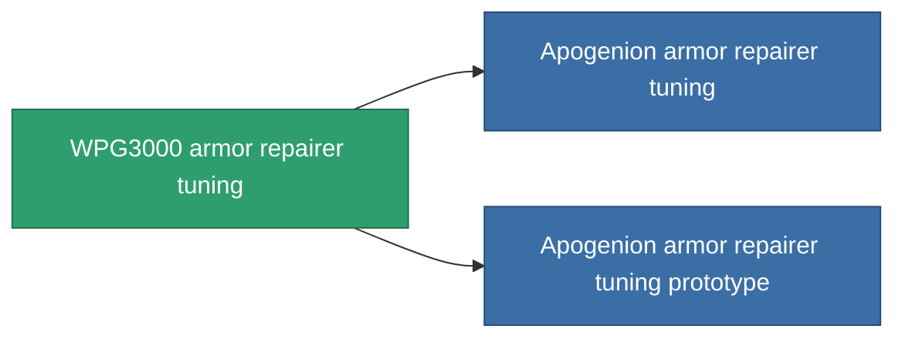

<!-- Generated by tools/generate from the live database (source: entitydefaults definition 1064, aggregatevalues via aggregatefields).
     Do not edit by hand; regenerate instead. -->

# WPG3000 armor repairer tuning

|  |  |
|---|---|
| Definition | `def_named2_armor_repairer_upgrade` |
| Tier | T3 |
| Health | 100 |
| Volume | 0.5 |
| Mass | 300 |
| Category | Modules / Repair |
| Tier line | [Standard armor repairer tuning](/content/items/standard-armor-repairer-upgrade/) (T1) → [Diaptes armor repairer tuning](/content/items/named1-armor-repairer-upgrade/) (T2) → **WPG3000 armor repairer tuning** (T3) → [Apogenion armor repairer tuning](/content/items/named3-armor-repairer-upgrade/) (T4) |

## Stats

| Field | Value |
|---|---|
| armor_repair_amount_modifier | 1.12 |
| armor_repair_cycle_time_modifier | 0.936 |
| cpu_usage | 37 |
| powergrid_usage | 27 |

<!-- production:generated -->
## Production

**Produced from 10 components, research level 5** — assemble the components to build it (see [Recipes](/content/recipes/) for the full list):

<svg class="prod-card-icon" aria-hidden="true"><use href="#mi-grid"/></svg><a class="prod-card-name" href="/content/items/alligior/">Alligior</a>

required: <b>150</b>

<svg class="prod-card-icon" aria-hidden="true"><use href="#mi-grid"/></svg><a class="prod-card-name" href="/content/items/chollonin/">Chollonin</a>

required: <b>50</b>

<svg class="prod-card-icon" aria-hidden="true"><use href="#mi-grid"/></svg><a class="prod-card-name" href="/content/items/espitium/">Espitium</a>

required: <b>50</b>

<svg class="prod-card-icon" aria-hidden="true"><use href="#mi-tree"/></svg><a class="prod-card-name" href="/content/items/named1-armor-repairer-upgrade/">Diaptes armor repairer tuning</a>

required: <b>1</b>

<svg class="prod-card-icon" aria-hidden="true"><use href="#mi-crystal"/></svg><a class="prod-card-name" href="/content/items/robotshard-common-advanced/">Functional common fragment</a>

required: <b>10</b>

<svg class="prod-card-icon" aria-hidden="true"><use href="#mi-crystal"/></svg><a class="prod-card-name" href="/content/items/robotshard-common-basic/">Damaged common fragment</a>

required: <b>10</b>

<svg class="prod-card-icon" aria-hidden="true"><use href="#mi-crystal"/></svg><a class="prod-card-name" href="/content/items/robotshard-nuimqol-advanced/">Functional nuimqol fragment</a>

required: <b>10</b>

<svg class="prod-card-icon" aria-hidden="true"><use href="#mi-crystal"/></svg><a class="prod-card-name" href="/content/items/robotshard-nuimqol-basic/">Damaged nuimqol fragment</a>

required: <b>10</b>

<svg class="prod-card-icon" aria-hidden="true"><use href="#mi-grid"/></svg><a class="prod-card-name" href="/content/items/statichnol/">Statichnol</a>

required: <b>150</b>

<svg class="prod-card-icon" aria-hidden="true"><use href="#mi-grid"/></svg><a class="prod-card-name" href="/content/items/titanium/">Titanium</a>

required: <b>100</b>

## Used in production

**Component of 2 items** — everything that uses it in production:

