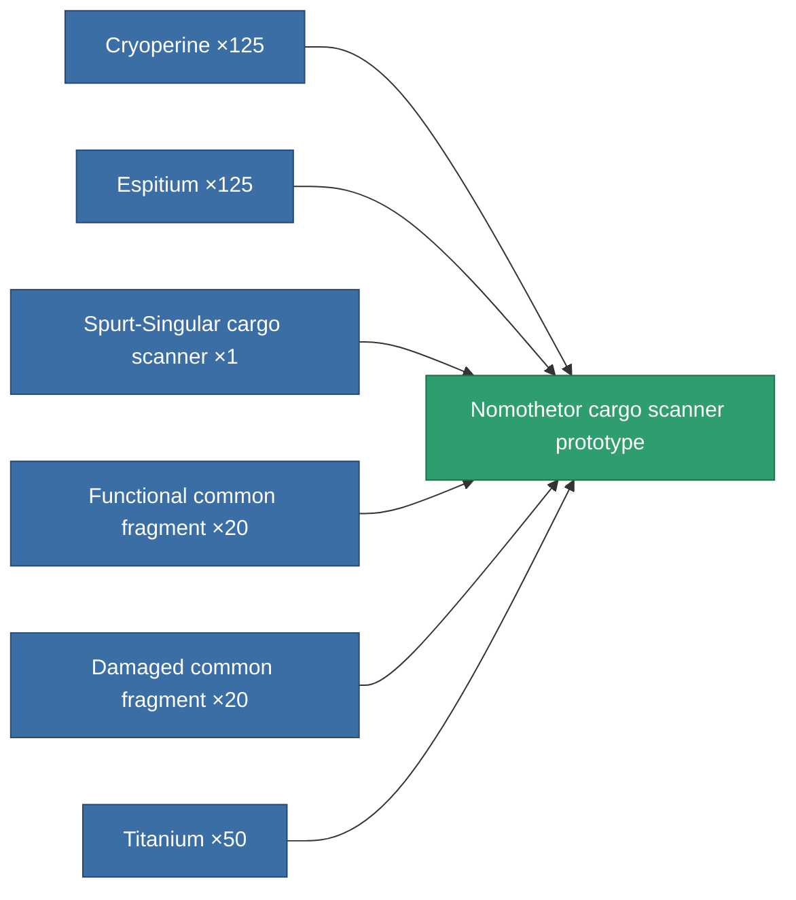

<!-- Generated by tools/generate from the live database (source: entitydefaults definition 2244, aggregatevalues via aggregatefields).
     Do not edit by hand; regenerate instead. -->

# Nomothetor cargo scanner prototype

|  |  |
|---|---|
| Definition | `def_named2_cargo_scanner_pr` |
| Tier | 3 |
| Health | 100 |
| Volume | 0.5 |
| Mass | 75 |
| Category | Modules / Sensors & scanning |

## Stats

| Field | Value |
|---|---|
| core_usage | 49 |
| cpu_usage | 22 |
| cycle_time | 7.5k |
| falloff | 20 |
| optimal_range | 15 |
| powergrid_usage | 10 |

<!-- production:generated -->
## Production

**Produced from 6 components, research level 5** — assemble the components to build it (see [Recipes](/content/recipes/) for the full list):

[All items](/content/items/)
