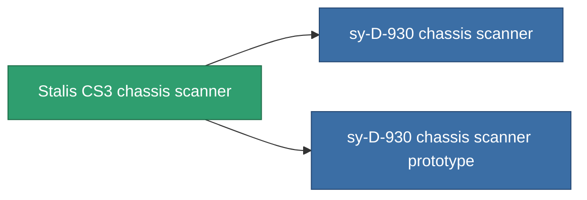

<!-- Generated by tools/generate from the live database (source: entitydefaults definition 778, aggregatevalues via aggregatefields).
     Do not edit by hand; regenerate instead. -->

# Stalis CS3 chassis scanner

|  |  |
|---|---|
| Definition | `def_named2_chassis_scanner` |
| Tier | 3 |
| Health | 100 |
| Volume | 0.5 |
| Mass | 200 |
| Category | Modules / Sensors & scanning |

## Stats

| Field | Value |
|---|---|
| core_usage | 20 |
| cpu_usage | 17 |
| cycle_time | 5k |
| falloff | 10 |
| optimal_range | 30 |
| powergrid_usage | 5 |

<!-- production:generated -->
## Production

**Component of 2 items** — everything that uses it in production:

[All items](/content/items/)
