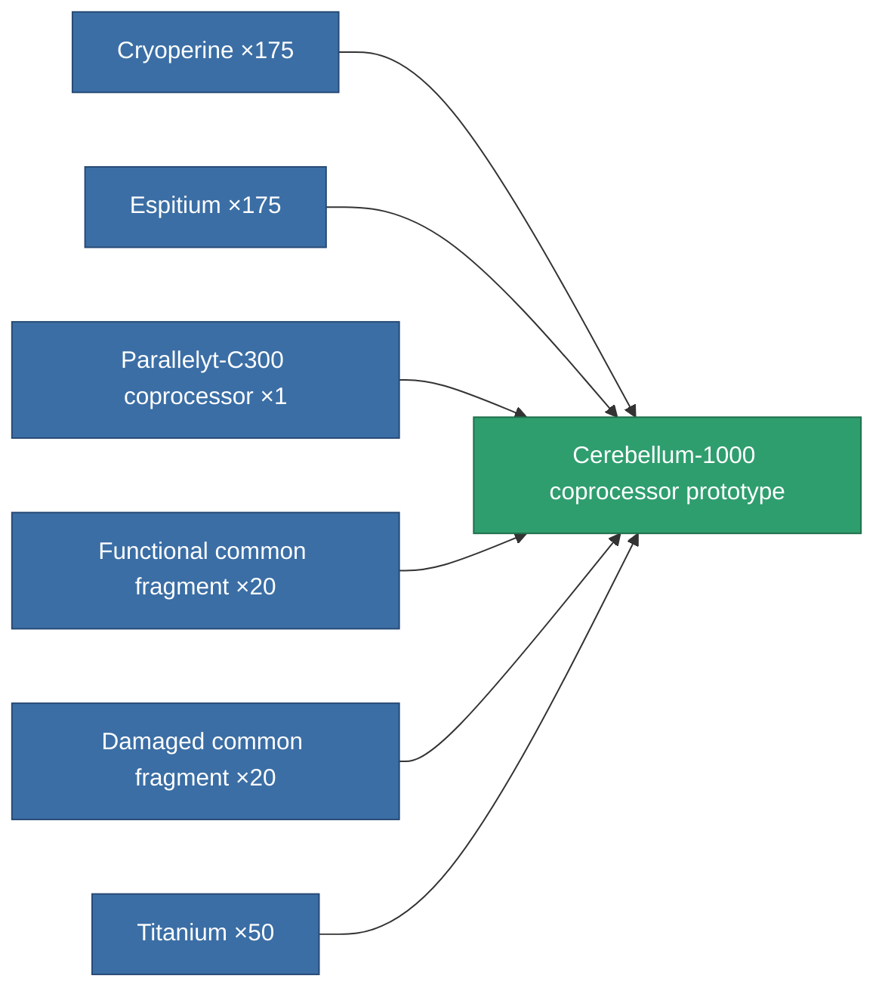

<!-- Generated by tools/generate from the live database (source: entitydefaults definition 2253, aggregatevalues via aggregatefields).
     Do not edit by hand; regenerate instead. -->

# Cerebellum-1000 coprocessor prototype

|  |  |
|---|---|
| Definition | `def_named2_cpu_upgrade_pr` |
| Tier | T3 (prototype) |
| Health | 100 |
| Volume | 0.01 |
| Mass | 0.15 |
| Category | Modules / Enhancements |
| Tier line | [Standard coprocessor](/content/items/standard-cpu-upgrade/) (T1) → [Parallelyt-C300 coprocessor](/content/items/named1-cpu-upgrade/) (T2) → [Cerebellum-1000 coprocessor](/content/items/named2-cpu-upgrade/) (T3) → **Cerebellum-1000 coprocessor prototype** (T3) → [Processyt-C1000 coprocessor](/content/items/named3-cpu-upgrade/) (T4) |

## Stats

| Field | Value |
|---|---|
| cpu_max_modifier | 1.152 |
| cpu_usage | 0 |
| powergrid_usage | 3 |

<!-- production:generated -->
## Production

**Produced from 6 components, research level 5** — assemble the components to build it (see [Recipes](/content/recipes/) for the full list):

[All items](/content/items/)
