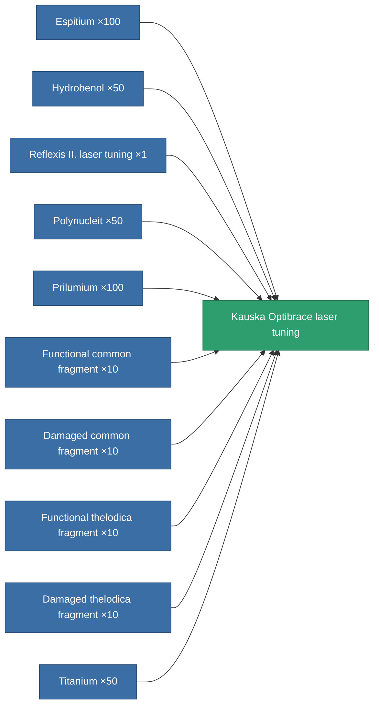
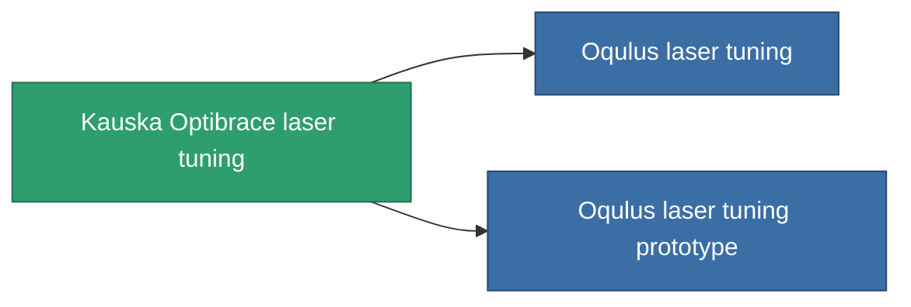

<!-- Generated by tools/generate from the live database (source: entitydefaults definition 931, aggregatevalues via aggregatefields).
     Do not edit by hand; regenerate instead. -->

# Kauska Optibrace laser tuning

|  |  |
|---|---|
| Definition | `def_named2_damage_mod_laser` |
| Tier | 3 |
| Health | 100 |
| Volume | 0.5 |
| Mass | 100 |
| Category | Modules / Weapons |

## Stats

| Field | Value |
|---|---|
| cpu_usage | 20 |
| damage_laser_modifier | 0.2 |
| powergrid_usage | 11 |

<!-- production:generated -->
## Production

**Produced from 10 components, research level 5** — assemble the components to build it (see [Recipes](/content/recipes/) for the full list):

## Used in production

**Component of 2 items** — everything that uses it in production:

[All items](/content/items/)
