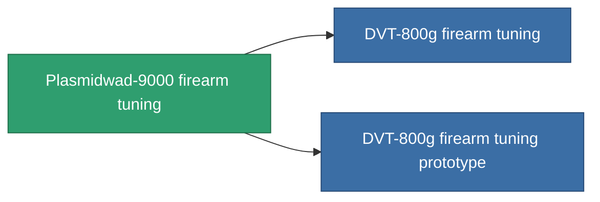

<!-- Generated by tools/generate from the live database (source: entitydefaults definition 934, aggregatevalues via aggregatefields).
     Do not edit by hand; regenerate instead. -->

# Plasmidwad-9000 firearm tuning

|  |  |
|---|---|
| Definition | `def_named2_damage_mod_projectile` |
| Tier | 3 |
| Health | 100 |
| Volume | 0.5 |
| Mass | 100 |
| Category | Modules / Enhancements |

## Stats

| Field | Value |
|---|---|
| cpu_usage | 15 |
| damage_projectile_modifier | 0.2 |
| powergrid_usage | 5 |

<!-- production:generated -->
## Production

**Component of 2 items** — everything that uses it in production:

[All items](/content/items/)
