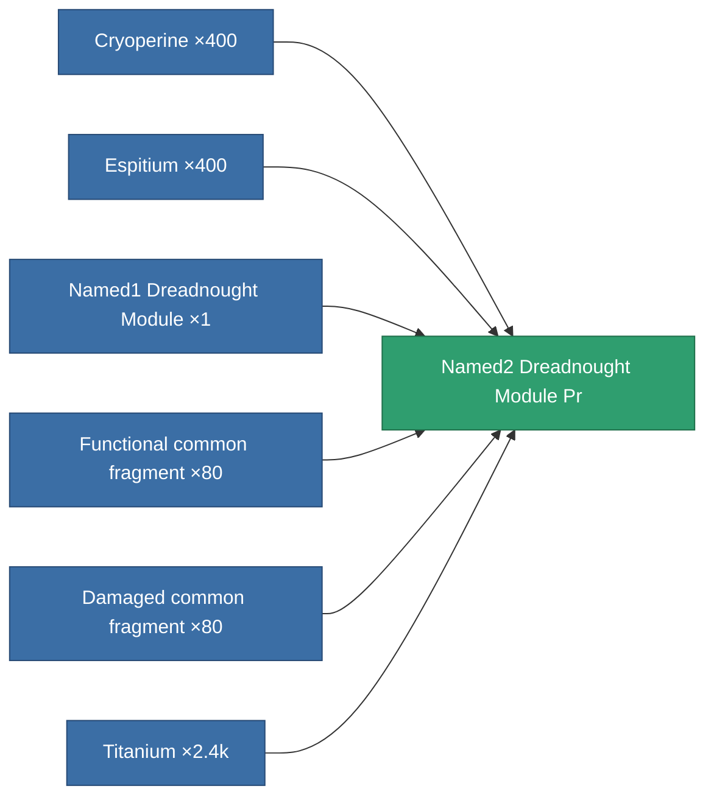

<!-- Generated by tools/generate from the live database (source: entitydefaults definition 8805, aggregatevalues via aggregatefields).
     Do not edit by hand; regenerate instead. -->

# Named2 Dreadnought Module Pr

|  |  |
|---|---|
| Definition | `def_named2_dreadnought_module_pr` |
| Tier | 3 |
| Health | 100 |
| Volume | 2.5 |
| Mass | 1250 |
| Category | Modules / Enhancements |

## Stats

| Field | Value |
|---|---|
| core_usage | 240 |
| cpu_usage | 441 |
| cycle_time | 180k |
| effect_dreadnought_blob_emission_modifier | 1.9 |
| effect_dreadnought_detection_strength_modifier | 150 |
| effect_dreadnought_optimal_range_modifier | 1.8 |
| effect_dreadnought_stealth_strength_modifier | -25 |
| effect_dreadnought_weapon_cycle_time_modifier | 0.7 |
| effect_dreadnought_weapon_damage_modifier | 1.4 |
| powergrid_usage | 1.368k |

<!-- production:generated -->
## Production

**Produced from 6 components, research level 7** — assemble the components to build it (see [Recipes](/content/recipes/) for the full list):

[All items](/content/items/)
