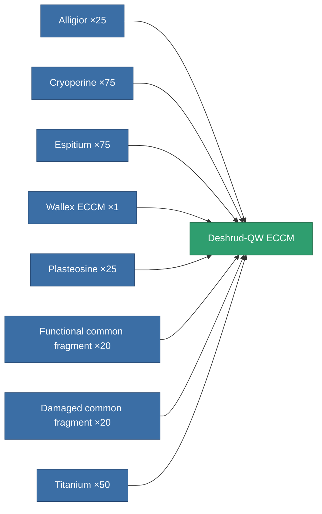
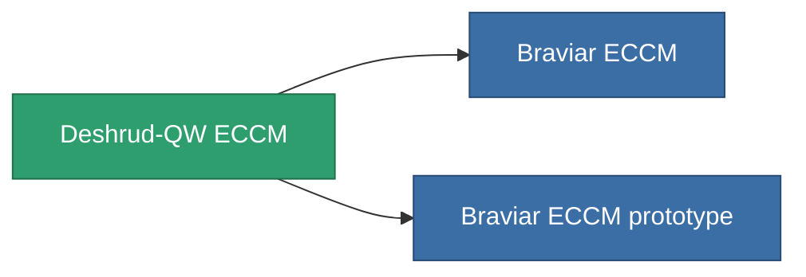

<!-- Generated by tools/generate from the live database (source: entitydefaults definition 796, aggregatevalues via aggregatefields).
     Do not edit by hand; regenerate instead. -->

# Deshrud-QW ECCM

|  |  |
|---|---|
| Definition | `def_named2_eccm` |
| Tier | 3 |
| Health | 100 |
| Volume | 0.5 |
| Mass | 100 |
| Category | Modules / Enhancements |

## Stats

| Field | Value |
|---|---|
| cpu_usage | 26 |
| powergrid_usage | 16 |
| sensor_strength_modifier | 65 |

<!-- production:generated -->
## Production

**Produced from 8 components, research level 4** — assemble the components to build it (see [Recipes](/content/recipes/) for the full list):

## Used in production

**Component of 2 items** — everything that uses it in production:

[All items](/content/items/)
