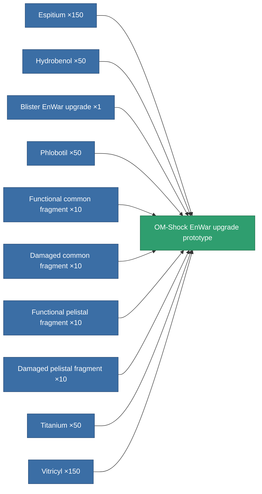

<!-- Generated by tools/generate from the live database (source: entitydefaults definition 5113, aggregatevalues via aggregatefields).
     Do not edit by hand; regenerate instead. -->

# OM-Shock EnWar upgrade prototype

|  |  |
|---|---|
| Definition | `def_named2_energy_warfare_upgrade_pr` |
| Tier | 3 |
| Health | 100 |
| Volume | 1 |
| Mass | 187.5 |
| Category | Modules / Enhancements |

## Stats

| Field | Value |
|---|---|
| core_usage_energy_neutralizers_modifier | 1.1 |
| cpu_usage | 23 |
| energy_neutralized_amount_modifier | 1.225 |
| energy_vampired_amount_modifier | 1.125 |
| powergrid_usage | 41 |

<!-- production:generated -->
## Production

**Produced from 10 components, research level 7** — assemble the components to build it (see [Recipes](/content/recipes/) for the full list):

[All items](/content/items/)
