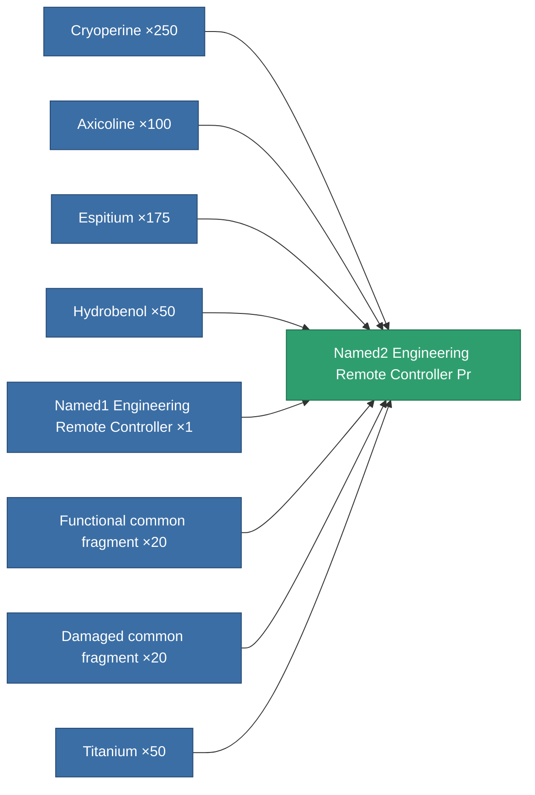

<!-- Generated by tools/generate from the live database (source: entitydefaults definition 9013, aggregatevalues via aggregatefields).
     Do not edit by hand; regenerate instead. -->

# Named2 Engineering Remote Controller Pr

|  |  |
|---|---|
| Definition | `def_named2_engineering_remote_controller_pr` |
| Tier | 3 |
| Health | 100 |
| Volume | 1 |
| Mass | 1 |
| Category | Modules / Remote control |

## Stats

| Field | Value |
|---|---|
| core_usage | 165 |
| cpu_usage | 80 |
| cycle_time | 7.5k |
| optimal_range | 25 |
| powergrid_usage | 75 |
| remote_control_bandwidth_max | 0 |
| remote_control_lifetime | 300k |
| remote_control_operational_range | 30 |
| turret_amplification_accuracy_modifier | 1 |
| turret_amplification_armor_max_modifier | 1 |
| turret_amplification_core_max_modifier | 1 |
| turret_amplification_core_recharge_time_modifier | 1 |
| turret_amplification_cycle_time_modifier | 1 |
| turret_amplification_damage_modifier | 1 |
| turret_amplification_locking_time_modifier | 1 |
| turret_amplification_long_range_modifier | 1 |
| turret_amplification_reactor_radiation_modifier | 1 |

<!-- production:generated -->
## Production

**Produced from 8 components, research level 7** — assemble the components to build it (see [Recipes](/content/recipes/) for the full list):

[All items](/content/items/)
