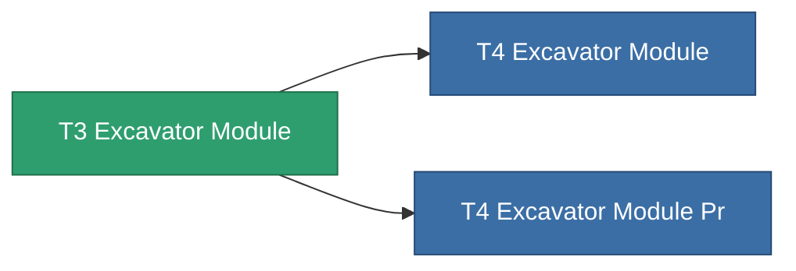

<!-- Generated by tools/generate from the live database (source: entitydefaults definition 8824, aggregatevalues via aggregatefields).
     Do not edit by hand; regenerate instead. -->

# T3 Excavator Module

|  |  |
|---|---|
| Definition | `def_named2_excavator_module` |
| Tier | T3 |
| Health | 100 |
| Volume | 2.5 |
| Mass | 1500 |
| Category | Modules / Harvesting |
| Tier line | [Standard Excavator Module](/content/items/standard-excavator-module/) (T1) → [T2 Excavator Module](/content/items/named1-excavator-module/) (T2) → **T3 Excavator Module** (T3) → [T4 Excavator Module](/content/items/named3-excavator-module/) (T4) |

## Stats

| Field | Value |
|---|---|
| core_usage | 180 |
| cpu_usage | 468 |
| cycle_time | 180k |
| effect_excavator_harvesting_amount_modifier | 1.4 |
| effect_excavator_mining_amount_modifier | 1.4 |
| effect_excavator_stealth_strength_modifier | -25 |
| powergrid_usage | 1.44k |

<!-- production:generated -->
## Production

**Produced from 6 components** — assemble the components to build it (see [Recipes](/content/recipes/) for the full list):

<svg class="prod-card-icon" aria-hidden="true"><use href="#mi-grid"/></svg><a class="prod-card-name" href="/content/items/axicol/">Cryoperine</a>

required: <b>400</b>

<svg class="prod-card-icon" aria-hidden="true"><use href="#mi-grid"/></svg><a class="prod-card-name" href="/content/items/espitium/">Espitium</a>

required: <b>400</b>

<svg class="prod-card-icon" aria-hidden="true"><use href="#mi-panel"/></svg><a class="prod-card-name" href="/content/items/named1-excavator-module/">T2 Excavator Module</a>

required: <b>1</b>

<svg class="prod-card-icon" aria-hidden="true"><use href="#mi-crystal"/></svg><a class="prod-card-name" href="/content/items/robotshard-common-advanced/">Functional common fragment</a>

required: <b>80</b>

<svg class="prod-card-icon" aria-hidden="true"><use href="#mi-crystal"/></svg><a class="prod-card-name" href="/content/items/robotshard-common-basic/">Damaged common fragment</a>

required: <b>80</b>

<svg class="prod-card-icon" aria-hidden="true"><use href="#mi-grid"/></svg><a class="prod-card-name" href="/content/items/titanium/">Titanium</a>

required: <b>2.4k</b>

## Used in production

**Component of 2 items** — everything that uses it in production:

