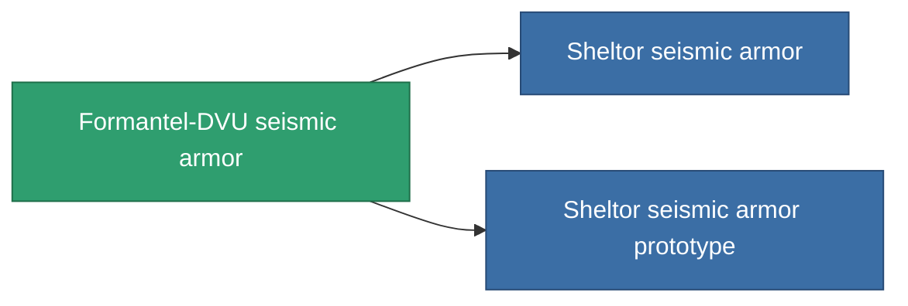

<!-- Generated by tools/generate from the live database (source: entitydefaults definition 718, aggregatevalues via aggregatefields).
     Do not edit by hand; regenerate instead. -->

# Formantel-DVU seismic armor

|  |  |
|---|---|
| Definition | `def_named2_exp_armor_hardener` |
| Tier | T3 |
| Health | 100 |
| Volume | 1 |
| Mass | 100 |
| Category | Modules / Armor |
| Tier line | [Standard seismic armor](/content/items/standard-exp-armor-hardener/) (T1) → [Ballistris I. seismic armor](/content/items/named1-exp-armor-hardener/) (T2) → **Formantel-DVU seismic armor** (T3) → [Sheltor seismic armor](/content/items/named3-exp-armor-hardener/) (T4) |

## Stats

| Field | Value |
|---|---|
| core_usage | 13 |
| cpu_usage | 25 |
| cycle_time | 10k |
| effect_resist_explosive | 110 |
| powergrid_usage | 5 |
| resist_explosive | 25 |

<!-- production:generated -->
## Production

**Produced from 10 components, research level 5** — assemble the components to build it (see [Recipes](/content/recipes/) for the full list):

<svg class="prod-card-icon" aria-hidden="true"><use href="#mi-grid"/></svg><a class="prod-card-name" href="/content/items/alligior/">Alligior</a>

required: <b>125</b>

<svg class="prod-card-icon" aria-hidden="true"><use href="#mi-grid"/></svg><a class="prod-card-name" href="/content/items/chollonin/">Chollonin</a>

required: <b>50</b>

<svg class="prod-card-icon" aria-hidden="true"><use href="#mi-grid"/></svg><a class="prod-card-name" href="/content/items/espitium/">Espitium</a>

required: <b>50</b>

<svg class="prod-card-icon" aria-hidden="true"><use href="#mi-tree"/></svg><a class="prod-card-name" href="/content/items/named1-exp-armor-hardener/">Ballistris I. seismic armor</a>

required: <b>1</b>

<svg class="prod-card-icon" aria-hidden="true"><use href="#mi-crystal"/></svg><a class="prod-card-name" href="/content/items/robotshard-common-advanced/">Functional common fragment</a>

required: <b>10</b>

<svg class="prod-card-icon" aria-hidden="true"><use href="#mi-crystal"/></svg><a class="prod-card-name" href="/content/items/robotshard-common-basic/">Damaged common fragment</a>

required: <b>10</b>

<svg class="prod-card-icon" aria-hidden="true"><use href="#mi-crystal"/></svg><a class="prod-card-name" href="/content/items/robotshard-thelodica-advanced/">Functional thelodica fragment</a>

required: <b>10</b>

<svg class="prod-card-icon" aria-hidden="true"><use href="#mi-crystal"/></svg><a class="prod-card-name" href="/content/items/robotshard-thelodica-basic/">Damaged thelodica fragment</a>

required: <b>10</b>

<svg class="prod-card-icon" aria-hidden="true"><use href="#mi-grid"/></svg><a class="prod-card-name" href="/content/items/statichnol/">Statichnol</a>

required: <b>125</b>

<svg class="prod-card-icon" aria-hidden="true"><use href="#mi-grid"/></svg><a class="prod-card-name" href="/content/items/titanium/">Titanium</a>

required: <b>100</b>

## Used in production

**Component of 2 items** — everything that uses it in production:

