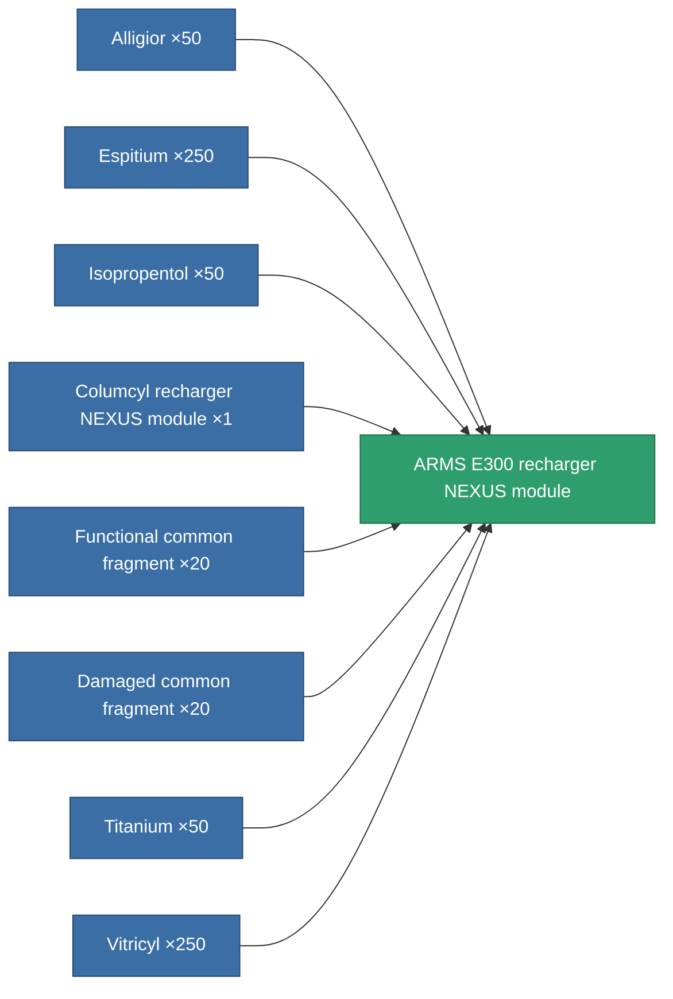
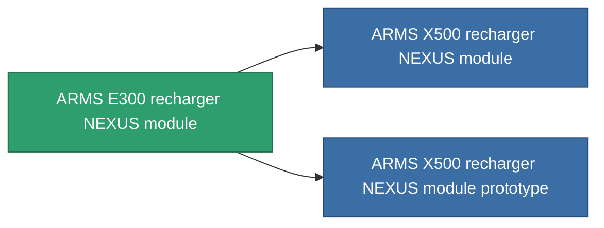

<!-- Generated by tools/generate from the live database (source: entitydefaults definition 2602, aggregatevalues via aggregatefields).
     Do not edit by hand; regenerate instead. -->

# ARMS E300 recharger NEXUS module

|  |  |
|---|---|
| Definition | `def_named2_gang_assist_core_management_module` |
| Tier | T3 |
| Health | 100 |
| Volume | 0.2 |
| Mass | 50 |
| Category | Modules / Enhancements |
| Tier line | [Standard recharger NEXUS module](/content/items/standard-gang-assist-core-management-module/) (T1) → [Columcyl recharger NEXUS module](/content/items/named1-gang-assist-core-management-module/) (T2) → **ARMS E300 recharger NEXUS module** (T3) → [ARMS X500 recharger NEXUS module](/content/items/named3-gang-assist-core-management-module/) (T4) |
| Note | core_recharge_time csokkent |

## Stats

| Field | Value |
|---|---|
| core_usage | 36 |
| cpu_usage | 88 |
| cycle_time | 10k |
| default_effect_range | 100 |
| effect_core_recharge_time_modifier | 0.95 |
| powergrid_usage | 36 |

<!-- production:generated -->
## Production

**Produced from 8 components, research level 6** — assemble the components to build it (see [Recipes](/content/recipes/) for the full list):

## Used in production

**Component of 2 items** — everything that uses it in production:

[All items](/content/items/)
