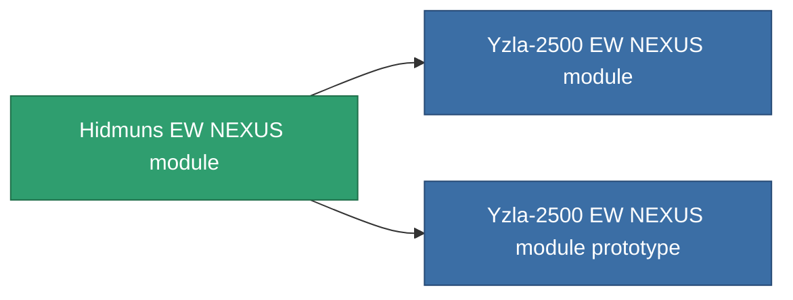

<!-- Generated by tools/generate from the live database (source: entitydefaults definition 2584, aggregatevalues via aggregatefields).
     Do not edit by hand; regenerate instead. -->

# Hidmuns EW NEXUS module

|  |  |
|---|---|
| Definition | `def_named2_gang_assist_ewar_range_module` |
| Tier | T3 |
| Health | 100 |
| Volume | 0.2 |
| Mass | 50 |
| Category | Modules / Enhancements |
| Tier line | [Standard EW NEXUS module](/content/items/standard-gang-assist-ewar-range-module/) (T1) → [Yzla-1500 EW NEXUS module](/content/items/named1-gang-assist-ewar-range-module/) (T2) → **Hidmuns EW NEXUS module** (T3) → [Yzla-2500 EW NEXUS module](/content/items/named3-gang-assist-ewar-range-module/) (T4) |
| Note | ew_optimalt novel |

## Stats

| Field | Value |
|---|---|
| core_usage | 36 |
| cpu_usage | 88 |
| cycle_time | 10k |
| default_effect_range | 100 |
| effect_ew_optimal_range_modifier | 1.05 |
| powergrid_usage | 36 |

<!-- production:generated -->
## Production

**Produced from 8 components, research level 6** — assemble the components to build it (see [Recipes](/content/recipes/) for the full list):

<svg class="prod-card-icon" aria-hidden="true"><use href="#mi-grid"/></svg><a class="prod-card-name" href="/content/items/axicol/">Cryoperine</a>

required: <b>250</b>

<svg class="prod-card-icon" aria-hidden="true"><use href="#mi-grid"/></svg><a class="prod-card-name" href="/content/items/axicoline/">Axicoline</a>

required: <b>50</b>

<svg class="prod-card-icon" aria-hidden="true"><use href="#mi-grid"/></svg><a class="prod-card-name" href="/content/items/espitium/">Espitium</a>

required: <b>250</b>

<svg class="prod-card-icon" aria-hidden="true"><use href="#mi-grid"/></svg><a class="prod-card-name" href="/content/items/hydrobenol/">Hydrobenol</a>

required: <b>50</b>

<svg class="prod-card-icon" aria-hidden="true"><use href="#mi-panel"/></svg><a class="prod-card-name" href="/content/items/named1-gang-assist-ewar-range-module/">Yzla-1500 EW NEXUS module</a>

required: <b>1</b>

<svg class="prod-card-icon" aria-hidden="true"><use href="#mi-crystal"/></svg><a class="prod-card-name" href="/content/items/robotshard-common-advanced/">Functional common fragment</a>

required: <b>20</b>

<svg class="prod-card-icon" aria-hidden="true"><use href="#mi-crystal"/></svg><a class="prod-card-name" href="/content/items/robotshard-common-basic/">Damaged common fragment</a>

required: <b>20</b>

<svg class="prod-card-icon" aria-hidden="true"><use href="#mi-grid"/></svg><a class="prod-card-name" href="/content/items/titanium/">Titanium</a>

required: <b>50</b>

## Used in production

**Component of 2 items** — everything that uses it in production:

