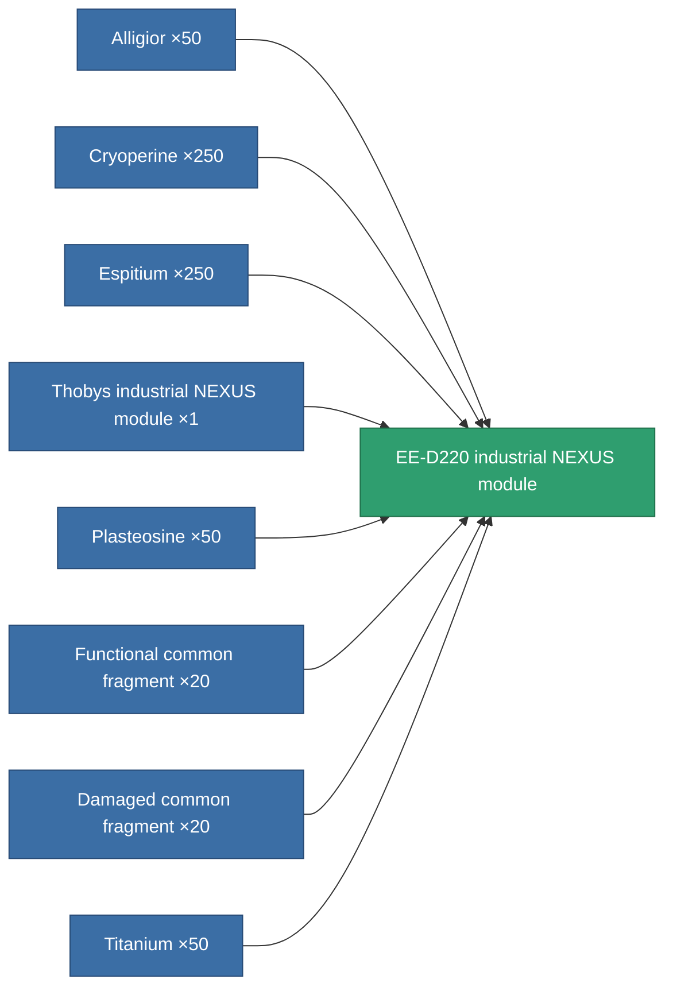
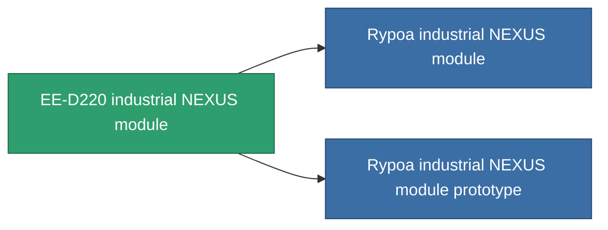

<!-- Generated by tools/generate from the live database (source: entitydefaults definition 2575, aggregatevalues via aggregatefields).
     Do not edit by hand; regenerate instead. -->

# EE-D220 industrial NEXUS module

|  |  |
|---|---|
| Definition | `def_named2_gang_assist_industry_module` |
| Tier | T3 |
| Health | 100 |
| Volume | 0.2 |
| Mass | 10 |
| Category | Modules / Enhancements |
| Tier line | [Standard industrial NEXUS module](/content/items/standard-gang-assist-industry-module/) (T1) → [Thobys industrial NEXUS module](/content/items/named1-gang-assist-industry-module/) (T2) → **EE-D220 industrial NEXUS module** (T3) → [Rypoa industrial NEXUS module](/content/items/named3-gang-assist-industry-module/) (T4) |
| Note | core_usage gathering  1.5% / ext lvl   |

## Stats

| Field | Value |
|---|---|
| core_usage | 36 |
| cpu_usage | 88 |
| cycle_time | 10k |
| default_effect_range | 100 |
| effect_core_usage_gathering_modifier | 0.95 |
| powergrid_usage | 36 |

<!-- production:generated -->
## Production

**Produced from 8 components, research level 6** — assemble the components to build it (see [Recipes](/content/recipes/) for the full list):

## Used in production

**Component of 2 items** — everything that uses it in production:

[All items](/content/items/)
