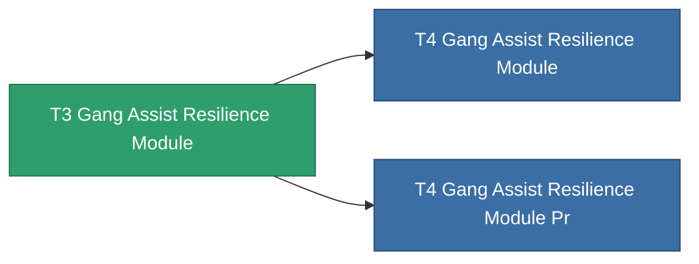

<!-- Generated by tools/generate from the live database (source: entitydefaults definition 2611, aggregatevalues via aggregatefields).
     Do not edit by hand; regenerate instead. -->

# T3 Gang Assist Resilience Module

|  |  |
|---|---|
| Definition | `def_named2_gang_assist_resilience_module` |
| Tier | T3 |
| Health | 100 |
| Volume | 0.2 |
| Mass | 50 |
| Category | Modules / Enhancements |
| Tier line | [Standard Gang Assist Resilience Module](/content/items/standard-gang-assist-resilience-module/) (T1) → [T2 Gang Assist Resilience Module](/content/items/named1-gang-assist-resilience-module/) (T2) → **T3 Gang Assist Resilience Module** (T3) → [T4 Gang Assist Resilience Module](/content/items/named3-gang-assist-resilience-module/) (T4) |
| Note | shield absorbtion ratiot javit |

## Stats

| Field | Value |
|---|---|
| core_usage | 36 |
| cpu_usage | 88 |
| cycle_time | 10k |
| default_effect_range | 100 |
| effect_devastate_resilience_modifier | 1.05 |
| powergrid_usage | 36 |

<!-- production:generated -->
## Production

**Produced from 5 components, research level 6** — assemble the components to build it (see [Recipes](/content/recipes/) for the full list):

<svg class="prod-card-icon" aria-hidden="true"><use href="#mi-panel"/></svg><a class="prod-card-name" href="/content/items/named1-gang-assist-resilience-module/">T2 Gang Assist Resilience Module</a>

required: <b>1</b>

<svg class="prod-card-icon" aria-hidden="true"><use href="#mi-crystal"/></svg><a class="prod-card-name" href="/content/items/robotshard-pelistal-advanced/">Functional pelistal fragment</a>

required: <b>10</b>

<svg class="prod-card-icon" aria-hidden="true"><use href="#mi-crystal"/></svg><a class="prod-card-name" href="/content/items/robotshard-pelistal-basic/">Damaged pelistal fragment</a>

required: <b>10</b>

<svg class="prod-card-icon" aria-hidden="true"><use href="#mi-crystal"/></svg><a class="prod-card-name" href="/content/items/robotshard-thelodica-advanced/">Functional thelodica fragment</a>

required: <b>10</b>

<svg class="prod-card-icon" aria-hidden="true"><use href="#mi-crystal"/></svg><a class="prod-card-name" href="/content/items/robotshard-thelodica-basic/">Damaged thelodica fragment</a>

required: <b>10</b>

## Used in production

**Component of 2 items** — everything that uses it in production:

