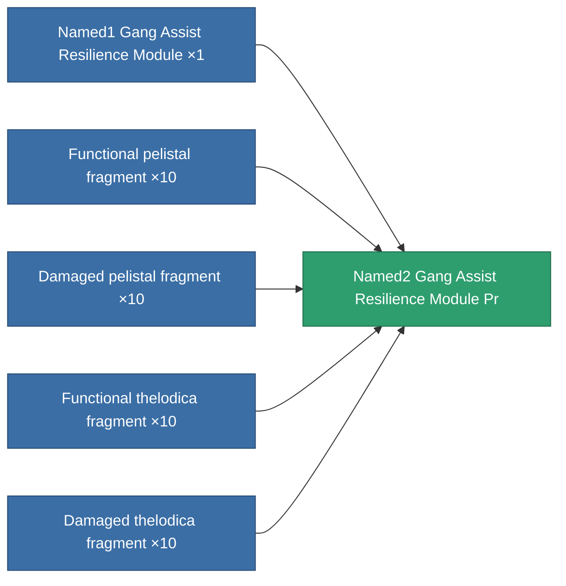

<!-- Generated by tools/generate from the live database (source: entitydefaults definition 2659, aggregatevalues via aggregatefields).
     Do not edit by hand; regenerate instead. -->

# Named2 Gang Assist Resilience Module Pr

|  |  |
|---|---|
| Definition | `def_named2_gang_assist_resilience_module_pr` |
| Tier | 3 |
| Health | 100 |
| Volume | 0.2 |
| Mass | 37.5 |
| Category | Modules / Enhancements |

## Stats

| Field | Value |
|---|---|
| core_usage | 32 |
| cpu_usage | 84 |
| cycle_time | 10k |
| default_effect_range | 100 |
| effect_devastate_resilience_modifier | 1.05 |
| effect_enhancer_aura_radius_modifier | 1.2 |
| powergrid_usage | 34 |

<!-- production:generated -->
## Production

**Produced from 5 components, research level 6** — assemble the components to build it (see [Recipes](/content/recipes/) for the full list):

[All items](/content/items/)
