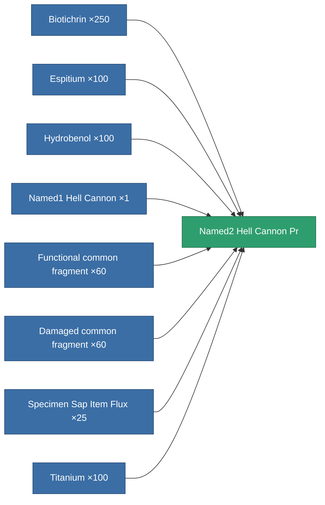

<!-- Generated by tools/generate from the live database (source: entitydefaults definition 8899, aggregatevalues via aggregatefields).
     Do not edit by hand; regenerate instead. -->

# Named2 Hell Cannon Pr

|  |  |
|---|---|
| Definition | `def_named2_hell_cannon_pr` |
| Tier | T3 (prototype) |
| Health | 100 |
| Volume | 1.8 |
| Mass | 1045 |
| Category | Modules / Weapons |
| Tier line | [Standard Hell Cannon](/content/items/standard-hell-cannon/) (T1) → [Named1 Hell Cannon](/content/items/named1-hell-cannon/) (T2) → [Named2 Hell Cannon](/content/items/named2-hell-cannon/) (T3) → **Named2 Hell Cannon Pr** (T3) → [Named3 Hell Cannon](/content/items/named3-hell-cannon/) (T4) |

## Stats

| Field | Value |
|---|---|
| accuracy | 44 |
| core_usage | 1.9 |
| cpu_usage | 57.475 |
| cycle_time | 8k |
| damage_modifier | 2.53 |
| falloff | 22 |
| optimal_range | 16.5 |
| powergrid_usage | 203.775 |

<!-- production:generated -->
## Production

**Produced from 8 components, research level 7** — assemble the components to build it (see [Recipes](/content/recipes/) for the full list):

[All items](/content/items/)
