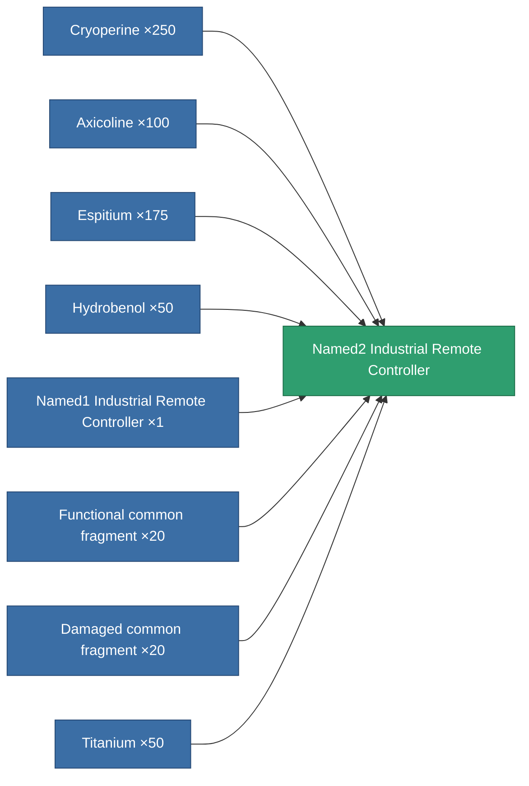
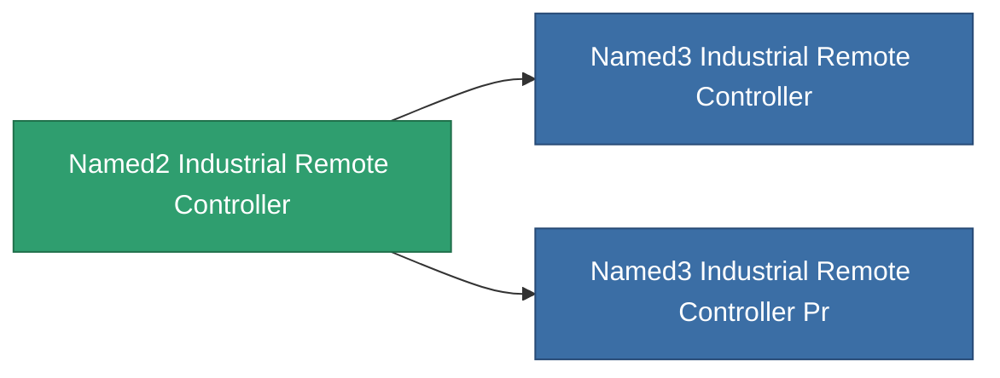

<!-- Generated by tools/generate from the live database (source: entitydefaults definition 8574, aggregatevalues via aggregatefields).
     Do not edit by hand; regenerate instead. -->

# Named2 Industrial Remote Controller

|  |  |
|---|---|
| Definition | `def_named2_industrial_remote_controller` |
| Tier | T3 |
| Health | 100 |
| Volume | 1 |
| Mass | 1 |
| Category | Modules / Remote control |
| Tier line | [Standard Industrial Remote Controller](/content/items/standard-industrial-remote-controller/) (T1) → [Named1 Industrial Remote Controller](/content/items/named1-industrial-remote-controller/) (T2) → **Named2 Industrial Remote Controller** (T3) → [Named3 Industrial Remote Controller](/content/items/named3-industrial-remote-controller/) (T4) |

## Stats

| Field | Value |
|---|---|
| core_usage | 165 |
| cpu_usage | 67 |
| cycle_time | 7.5k |
| drone_amplification_armor_max_modifier | 1 |
| drone_amplification_core_max_modifier | 1 |
| drone_amplification_core_recharge_time_modifier | 1 |
| drone_amplification_harvesting_amount_modifier | 1 |
| drone_amplification_locking_time_modifier | 1 |
| drone_amplification_mining_amount_modifier | 1 |
| drone_amplification_reactor_radiation_modifier | 1 |
| drone_amplification_speed_max_modifier | 1 |
| powergrid_usage | 67 |
| remote_control_bandwidth_max | 0 |
| remote_control_lifetime | 240k |
| remote_control_operational_range | 25 |

<!-- production:generated -->
## Production

**Produced from 8 components** — assemble the components to build it (see [Recipes](/content/recipes/) for the full list):

## Used in production

**Component of 2 items** — everything that uses it in production:

[All items](/content/items/)
