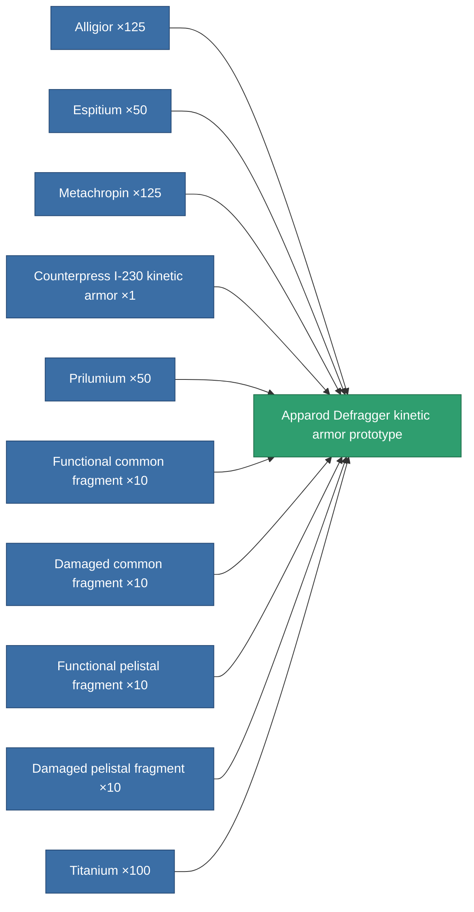

<!-- Generated by tools/generate from the live database (source: entitydefaults definition 2198, aggregatevalues via aggregatefields).
     Do not edit by hand; regenerate instead. -->

# Apparod Defragger kinetic armor prototype

|  |  |
|---|---|
| Definition | `def_named2_kin_armor_hardener_pr` |
| Tier | T3 (prototype) |
| Health | 100 |
| Volume | 1 |
| Mass | 75 |
| Category | Modules / Armor |
| Tier line | [Standard kinetic armor](/content/items/standard-kin-armor-hardener/) (T1) → [Counterpress I-230 kinetic armor](/content/items/named1-kin-armor-hardener/) (T2) → [Apparod Defragger kinetic armor](/content/items/named2-kin-armor-hardener/) (T3) → **Apparod Defragger kinetic armor prototype** (T3) → [Grampier-VK kinetic armor](/content/items/named3-kin-armor-hardener/) (T4) |

## Stats

| Field | Value |
|---|---|
| core_usage | 10 |
| cpu_usage | 24 |
| cycle_time | 10k |
| effect_resist_kinetic | 110 |
| powergrid_usage | 5 |
| resist_kinetic | 25 |

<!-- production:generated -->
## Production

**Produced from 10 components, research level 5** — assemble the components to build it (see [Recipes](/content/recipes/) for the full list):

[All items](/content/items/)
