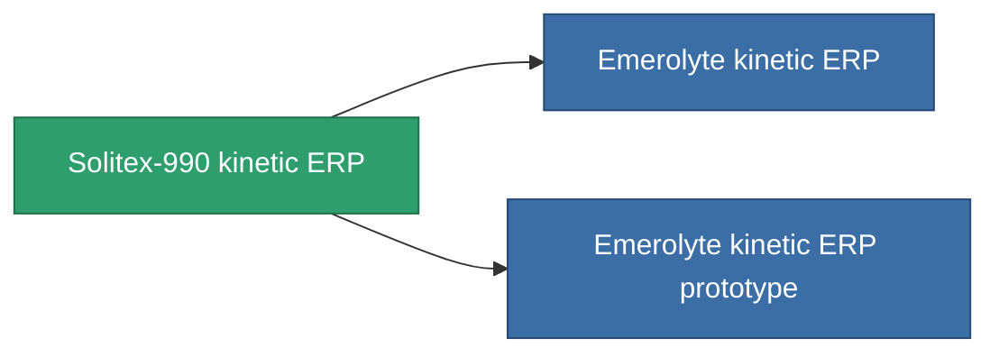

<!-- Generated by tools/generate from the live database (source: entitydefaults definition 3295, aggregatevalues via aggregatefields).
     Do not edit by hand; regenerate instead. -->

# Solitex-990 kinetic ERP

|  |  |
|---|---|
| Definition | `def_named2_kinetic_kers` |
| Tier | T3 |
| Health | 100 |
| Volume | 1 |
| Mass | 500 |
| Category | Modules / Enhancements |
| Tier line | [Standard kinetic ERP](/content/items/standard-kinetic-kers/) (T1) → [Hegatex-1000 kinetic ERP](/content/items/named1-kinetic-kers/) (T2) → **Solitex-990 kinetic ERP** (T3) → [Emerolyte kinetic ERP](/content/items/named3-kinetic-kers/) (T4) |

## Stats

| Field | Value |
|---|---|
| chemical_damage_to_core_modifier | 0.25 |
| cpu_usage | 53 |
| explosive_damage_to_core_modifier | 0.125 |
| kinetic_damage_to_core_modifier | 0.6 |
| powergrid_usage | 17 |
| thermal_damage_to_core_modifier | 0.125 |

<!-- production:generated -->
## Production

**Produced from 10 components, research level 7** — assemble the components to build it (see [Recipes](/content/recipes/) for the full list):

<svg class="prod-card-icon" aria-hidden="true"><use href="#mi-grid"/></svg><a class="prod-card-name" href="/content/items/alligior/">Alligior</a>

required: <b>100</b>

<svg class="prod-card-icon" aria-hidden="true"><use href="#mi-grid"/></svg><a class="prod-card-name" href="/content/items/espitium/">Espitium</a>

required: <b>200</b>

<svg class="prod-card-icon" aria-hidden="true"><use href="#mi-grid"/></svg><a class="prod-card-name" href="/content/items/metachropin/">Metachropin</a>

required: <b>100</b>

<svg class="prod-card-icon" aria-hidden="true"><use href="#mi-grid"/></svg><a class="prod-card-name" href="/content/items/named1-kinetic-kers/">Hegatex-1000 kinetic ERP</a>

required: <b>1</b>

<svg class="prod-card-icon" aria-hidden="true"><use href="#mi-grid"/></svg><a class="prod-card-name" href="/content/items/prilumium/">Prilumium</a>

required: <b>200</b>

<svg class="prod-card-icon" aria-hidden="true"><use href="#mi-crystal"/></svg><a class="prod-card-name" href="/content/items/robotshard-common-advanced/">Functional common fragment</a>

required: <b>3</b>

<svg class="prod-card-icon" aria-hidden="true"><use href="#mi-crystal"/></svg><a class="prod-card-name" href="/content/items/robotshard-common-basic/">Damaged common fragment</a>

required: <b>2</b>

<svg class="prod-card-icon" aria-hidden="true"><use href="#mi-crystal"/></svg><a class="prod-card-name" href="/content/items/robotshard-thelodica-advanced/">Functional thelodica fragment</a>

required: <b>3</b>

<svg class="prod-card-icon" aria-hidden="true"><use href="#mi-crystal"/></svg><a class="prod-card-name" href="/content/items/robotshard-thelodica-basic/">Damaged thelodica fragment</a>

required: <b>2</b>

<svg class="prod-card-icon" aria-hidden="true"><use href="#mi-grid"/></svg><a class="prod-card-name" href="/content/items/titanium/">Titanium</a>

required: <b>200</b>

## Used in production

**Component of 2 items** — everything that uses it in production:

