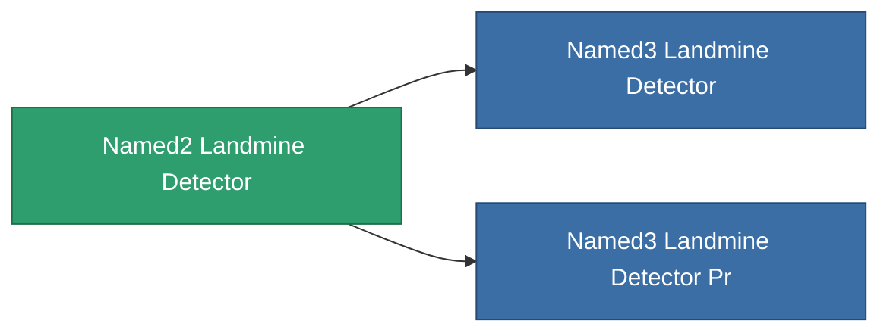

<!-- Generated by tools/generate from the live database (source: entitydefaults definition 8316, aggregatevalues via aggregatefields).
     Do not edit by hand; regenerate instead. -->

# Named2 Landmine Detector

|  |  |
|---|---|
| Definition | `def_named2_landmine_detector` |
| Tier | 3 |
| Health | 100 |
| Volume | 1.5 |
| Mass | 1000 |
| Category | Modules / Enhancements |

## Stats

| Field | Value |
|---|---|
| core_usage | 14 |
| cpu_usage | 23 |
| cycle_time | 10k |
| effect_mine_detection_range_modifier | 1.4 |
| powergrid_usage | 7 |

<!-- production:generated -->
## Production

**Component of 2 items** — everything that uses it in production:

[All items](/content/items/)
