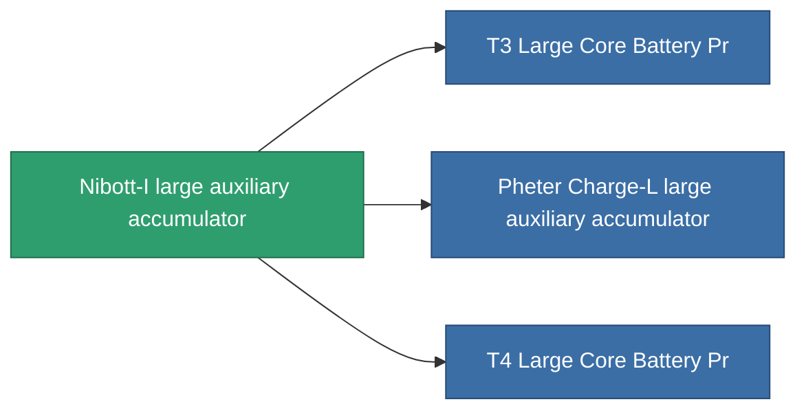

<!-- Generated by tools/generate from the live database (source: entitydefaults definition 820, aggregatevalues via aggregatefields).
     Do not edit by hand; regenerate instead. -->

# Nibott-I large auxiliary accumulator

|  |  |
|---|---|
| Definition | `def_named2_large_core_battery` |
| Tier | T3 |
| Health | 100 |
| Volume | 3 |
| Mass | 3000 |
| Category | Modules / Power |
| Tier line | [Standard large auxiliary accumulator](/content/items/standard-large-core-battery/) (T1) → [Ovostec-gxc9000 large auxiliary accumulator](/content/items/named1-large-core-battery/) (T2) → **Nibott-I large auxiliary accumulator** (T3) → [Pheter Charge-L large auxiliary accumulator](/content/items/named3-large-core-battery/) (T4) |

## Stats

| Field | Value |
|---|---|
| core_max | 1.2k |
| cpu_usage | 430 |
| powergrid_usage | 856 |

<!-- production:generated -->
## Production

**Produced from 7 components** — assemble the components to build it (see [Recipes](/content/recipes/) for the full list):

<svg class="prod-card-icon" aria-hidden="true"><use href="#mi-grid"/></svg><a class="prod-card-name" href="/content/items/axicol/">Cryoperine</a>

required: <b>300</b>

<svg class="prod-card-icon" aria-hidden="true"><use href="#mi-grid"/></svg><a class="prod-card-name" href="/content/items/espitium/">Espitium</a>

required: <b>300</b>

<svg class="prod-card-icon" aria-hidden="true"><use href="#mi-grid"/></svg><a class="prod-card-name" href="/content/items/named1-large-core-battery/">Ovostec-gxc9000 large auxiliary accumulator</a>

required: <b>1</b>

<svg class="prod-card-icon" aria-hidden="true"><use href="#mi-crystal"/></svg><a class="prod-card-name" href="/content/items/robotshard-common-advanced/">Functional common fragment</a>

required: <b>60</b>

<svg class="prod-card-icon" aria-hidden="true"><use href="#mi-crystal"/></svg><a class="prod-card-name" href="/content/items/robotshard-common-basic/">Damaged common fragment</a>

required: <b>60</b>

<svg class="prod-card-icon" aria-hidden="true"><use href="#mi-grid"/></svg><a class="prod-card-name" href="/content/items/specimen-sap-item-flux/">Specimen Sap Item Flux</a>

required: <b>25</b>

<svg class="prod-card-icon" aria-hidden="true"><use href="#mi-grid"/></svg><a class="prod-card-name" href="/content/items/titanium/">Titanium</a>

required: <b>300</b>

## Used in production

**Component of 3 items** — everything that uses it in production:

