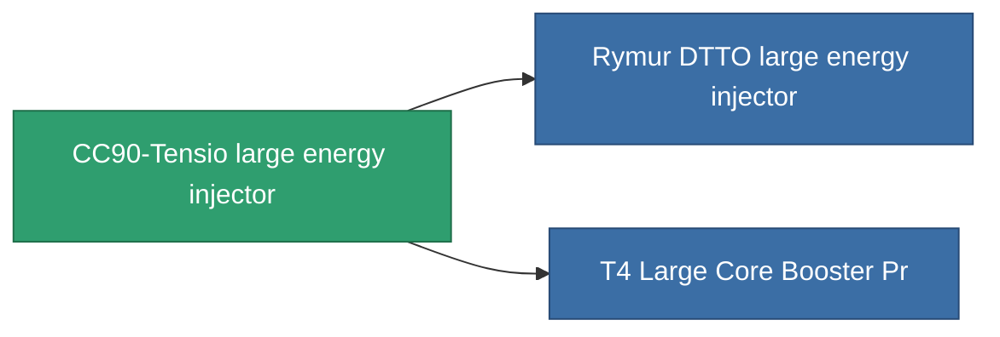

<!-- Generated by tools/generate from the live database (source: entitydefaults definition 829, aggregatevalues via aggregatefields).
     Do not edit by hand; regenerate instead. -->

# CC90-Tensio large energy injector

|  |  |
|---|---|
| Definition | `def_named2_large_core_booster` |
| Tier | T3 |
| Health | 100 |
| Volume | 2 |
| Mass | 1600 |
| Category | Modules / Enhancements |
| Tier line | [Standard large energy injector](/content/items/standard-large-core-booster/) (T1) → [Shoxit Parter II. large energy injector](/content/items/named1-large-core-booster/) (T2) → **CC90-Tensio large energy injector** (T3) → [Rymur DTTO large energy injector](/content/items/named3-large-core-booster/) (T4) |

## Stats

| Field | Value |
|---|---|
| core_usage | 0 |
| cpu_usage | 375 |
| cycle_time | 5.5k |
| powergrid_usage | 1.375k |

<!-- production:generated -->
## Production

**Produced from 7 components** — assemble the components to build it (see [Recipes](/content/recipes/) for the full list):

<svg class="prod-card-icon" aria-hidden="true"><use href="#mi-grid"/></svg><a class="prod-card-name" href="/content/items/axicol/">Cryoperine</a>

required: <b>150</b>

<svg class="prod-card-icon" aria-hidden="true"><use href="#mi-grid"/></svg><a class="prod-card-name" href="/content/items/espitium/">Espitium</a>

required: <b>150</b>

<svg class="prod-card-icon" aria-hidden="true"><use href="#mi-grid"/></svg><a class="prod-card-name" href="/content/items/named1-large-core-booster/">Shoxit Parter II. large energy injector</a>

required: <b>1</b>

<svg class="prod-card-icon" aria-hidden="true"><use href="#mi-crystal"/></svg><a class="prod-card-name" href="/content/items/robotshard-common-advanced/">Functional common fragment</a>

required: <b>60</b>

<svg class="prod-card-icon" aria-hidden="true"><use href="#mi-crystal"/></svg><a class="prod-card-name" href="/content/items/robotshard-common-basic/">Damaged common fragment</a>

required: <b>60</b>

<svg class="prod-card-icon" aria-hidden="true"><use href="#mi-grid"/></svg><a class="prod-card-name" href="/content/items/specimen-sap-item-flux/">Specimen Sap Item Flux</a>

required: <b>15</b>

<svg class="prod-card-icon" aria-hidden="true"><use href="#mi-grid"/></svg><a class="prod-card-name" href="/content/items/titanium/">Titanium</a>

required: <b>300</b>

## Used in production

**Component of 2 items** — everything that uses it in production:

