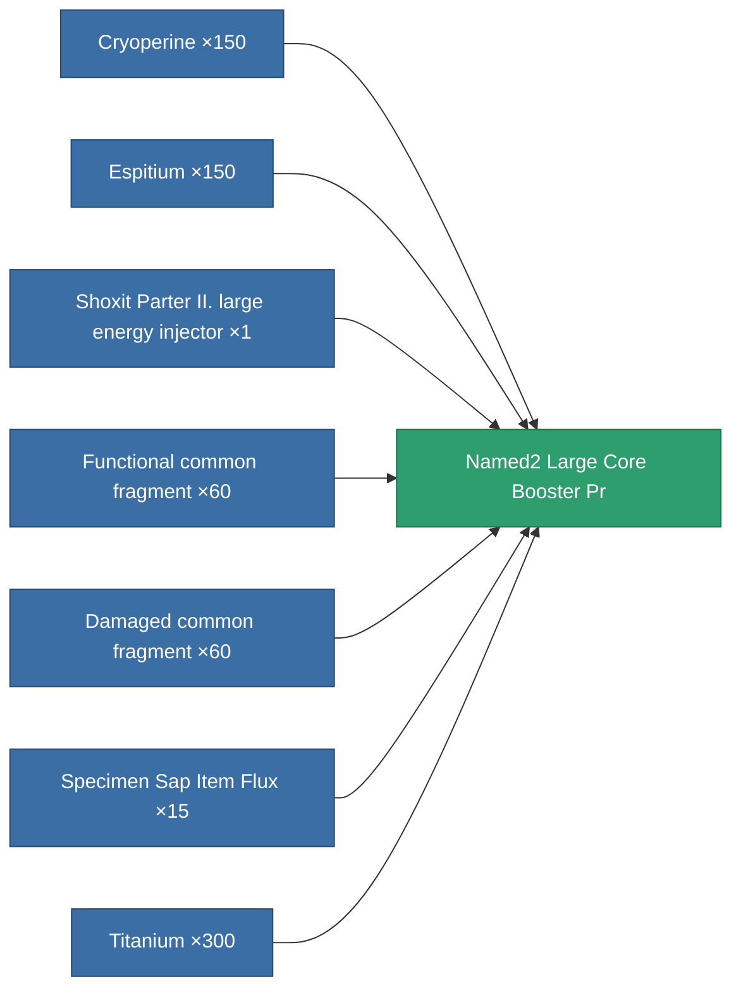

<!-- Generated by tools/generate from the live database (source: entitydefaults definition 5780, aggregatevalues via aggregatefields).
     Do not edit by hand; regenerate instead. -->

# Named2 Large Core Booster Pr

|  |  |
|---|---|
| Definition | `def_named2_large_core_booster_pr` |
| Tier | 3 |
| Health | 100 |
| Volume | 2 |
| Mass | 1600 |
| Category | Modules / Enhancements |
| Note | large module |

## Stats

| Field | Value |
|---|---|
| core_usage | 0 |
| cpu_usage | 375 |
| cycle_time | 5.5k |
| powergrid_usage | 1.375k |

<!-- production:generated -->
## Production

**Produced from 7 components, research level 7** — assemble the components to build it (see [Recipes](/content/recipes/) for the full list):

[All items](/content/items/)
