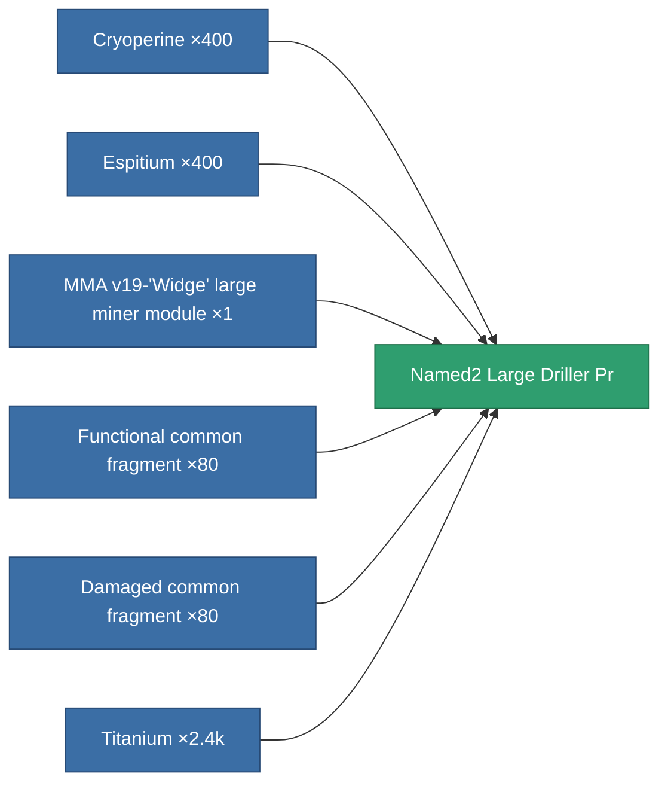

<!-- Generated by tools/generate from the live database (source: entitydefaults definition 8684, aggregatevalues via aggregatefields).
     Do not edit by hand; regenerate instead. -->

# Named2 Large Driller Pr

|  |  |
|---|---|
| Definition | `def_named2_large_driller_pr` |
| Tier | T3 (prototype) |
| Health | 100 |
| Volume | 2.5 |
| Mass | 1250 |
| Category | Modules / Enhancements |
| Tier line | [Standard large miner module](/content/items/standard-large-driller/) (T1) → [MMA v19-'Widge' large miner module](/content/items/named1-large-driller/) (T2) → [Sublimator Hi-D large miner module](/content/items/named2-large-driller/) (T3) → **Named2 Large Driller Pr** (T3) → [Pellex large miner module](/content/items/named3-large-driller/) (T4) |

## Stats

| Field | Value |
|---|---|
| core_usage | 240 |
| cpu_usage | 441 |
| cycle_time | 11k |
| powergrid_usage | 1.368k |

<!-- production:generated -->
## Production

**Produced from 6 components, research level 7** — assemble the components to build it (see [Recipes](/content/recipes/) for the full list):

[All items](/content/items/)
