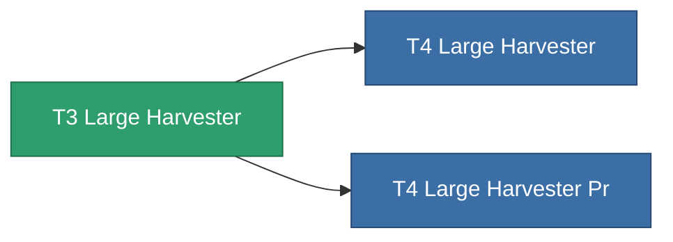

<!-- Generated by tools/generate from the live database (source: entitydefaults definition 8866, aggregatevalues via aggregatefields).
     Do not edit by hand; regenerate instead. -->

# T3 Large Harvester

|  |  |
|---|---|
| Definition | `def_named2_large_harvester` |
| Tier | T3 |
| Health | 100 |
| Volume | 2.5 |
| Mass | 1500 |
| Category | Modules / Harvesting |
| Tier line | [Standard Large Harvester](/content/items/standard-large-harvester/) (T1) → [T2 Large Harvester](/content/items/named1-large-harvester/) (T2) → **T3 Large Harvester** (T3) → [T4 Large Harvester](/content/items/named3-large-harvester/) (T4) |

## Stats

| Field | Value |
|---|---|
| core_usage | 180 |
| cpu_usage | 468 |
| cycle_time | 11k |
| powergrid_usage | 1.44k |

<!-- production:generated -->
## Production

**Produced from 6 components** — assemble the components to build it (see [Recipes](/content/recipes/) for the full list):

<svg class="prod-card-icon" aria-hidden="true"><use href="#mi-grid"/></svg><a class="prod-card-name" href="/content/items/axicol/">Cryoperine</a>

required: <b>400</b>

<svg class="prod-card-icon" aria-hidden="true"><use href="#mi-grid"/></svg><a class="prod-card-name" href="/content/items/espitium/">Espitium</a>

required: <b>400</b>

<svg class="prod-card-icon" aria-hidden="true"><use href="#mi-grid"/></svg><a class="prod-card-name" href="/content/items/named1-large-harvester/">T2 Large Harvester</a>

required: <b>1</b>

<svg class="prod-card-icon" aria-hidden="true"><use href="#mi-crystal"/></svg><a class="prod-card-name" href="/content/items/robotshard-common-advanced/">Functional common fragment</a>

required: <b>80</b>

<svg class="prod-card-icon" aria-hidden="true"><use href="#mi-crystal"/></svg><a class="prod-card-name" href="/content/items/robotshard-common-basic/">Damaged common fragment</a>

required: <b>80</b>

<svg class="prod-card-icon" aria-hidden="true"><use href="#mi-grid"/></svg><a class="prod-card-name" href="/content/items/titanium/">Titanium</a>

required: <b>2.4k</b>

## Used in production

**Component of 2 items** — everything that uses it in production:

