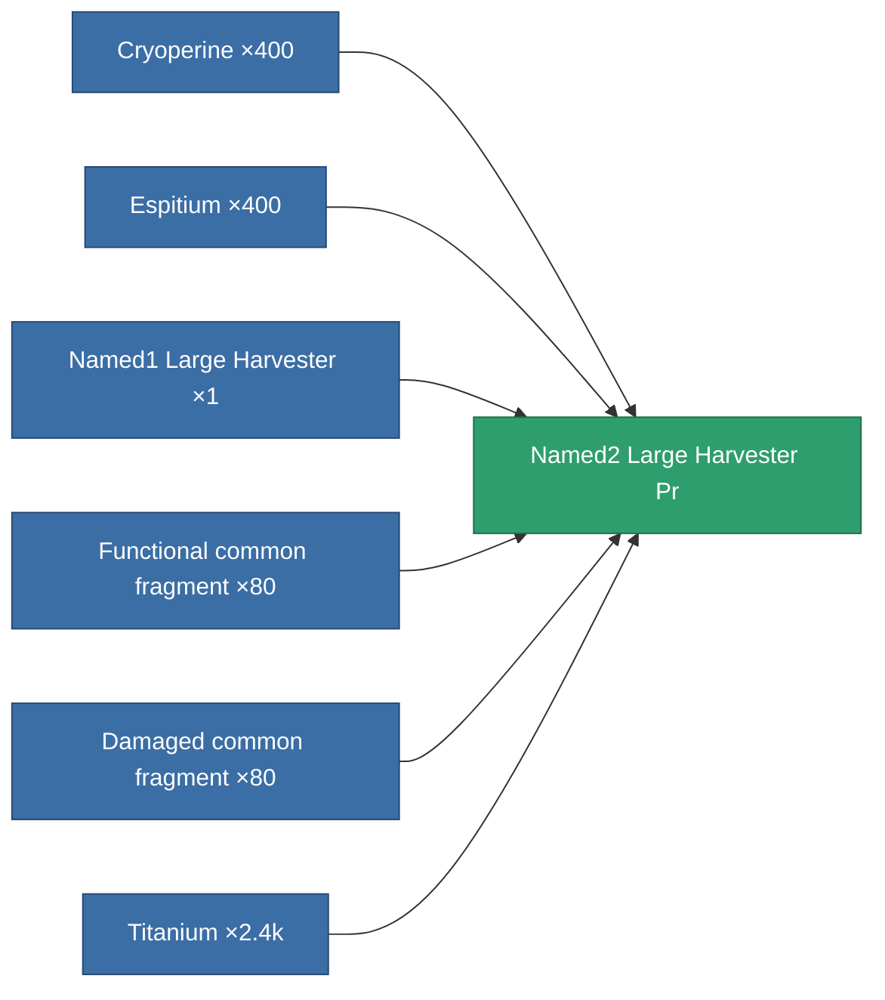

<!-- Generated by tools/generate from the live database (source: entitydefaults definition 8867, aggregatevalues via aggregatefields).
     Do not edit by hand; regenerate instead. -->

# Named2 Large Harvester Pr

|  |  |
|---|---|
| Definition | `def_named2_large_harvester_pr` |
| Tier | 3 |
| Health | 100 |
| Volume | 2.5 |
| Mass | 1250 |
| Category | Modules / Harvesting |

## Stats

| Field | Value |
|---|---|
| core_usage | 240 |
| cpu_usage | 441 |
| cycle_time | 11k |
| powergrid_usage | 1.368k |

<!-- production:generated -->
## Production

**Produced from 6 components, research level 7** — assemble the components to build it (see [Recipes](/content/recipes/) for the full list):

[All items](/content/items/)
