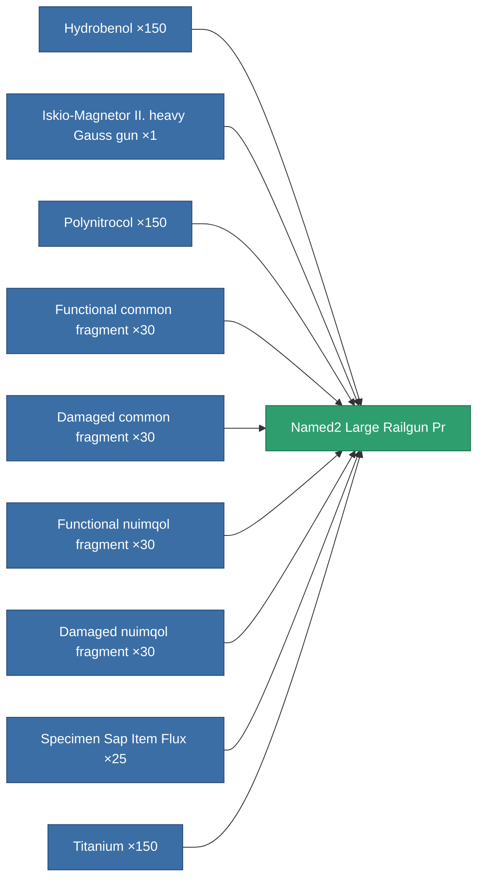

<!-- Generated by tools/generate from the live database (source: entitydefaults definition 5816, aggregatevalues via aggregatefields).
     Do not edit by hand; regenerate instead. -->

# Named2 Large Railgun Pr

|  |  |
|---|---|
| Definition | `def_named2_large_railgun_pr` |
| Tier | 3 |
| Health | 100 |
| Volume | 1.5 |
| Mass | 1000 |
| Category | Modules / Weapons |
| Note | large weapon module |

## Stats

| Field | Value |
|---|---|
| accuracy | 40.5 |
| core_usage | 10.5 |
| cpu_usage | 87.5 |
| cycle_time | 6k |
| damage_modifier | 3 |
| falloff | 6 |
| optimal_range | 21.5 |
| powergrid_usage | 247.5 |

<!-- production:generated -->
## Production

**Produced from 9 components, research level 7** — assemble the components to build it (see [Recipes](/content/recipes/) for the full list):

[All items](/content/items/)
