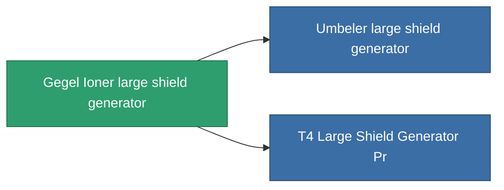

<!-- Generated by tools/generate from the live database (source: entitydefaults definition 730, aggregatevalues via aggregatefields).
     Do not edit by hand; regenerate instead. -->

# Gegel Ioner large shield generator

|  |  |
|---|---|
| Definition | `def_named2_large_shield_generator` |
| Tier | T3 |
| Health | 100 |
| Volume | 1 |
| Mass | 880 |
| Category | Modules / Shield |
| Tier line | [Standard large shield generator](/content/items/standard-large-shield-generator/) (T1) → [AVA-Spintarge large shield generator](/content/items/named1-large-shield-generator/) (T2) → **Gegel Ioner large shield generator** (T3) → [Umbeler large shield generator](/content/items/named3-large-shield-generator/) (T4) |

## Stats

| Field | Value |
|---|---|
| core_usage | 30 |
| cpu_usage | 335 |
| cycle_time | 7.75k |
| powergrid_usage | 1.35k |
| shield_absorbtion | 2 |
| shield_radius | 30 |

<!-- production:generated -->
## Production

**Produced from 9 components** — assemble the components to build it (see [Recipes](/content/recipes/) for the full list):

<svg class="prod-card-icon" aria-hidden="true"><use href="#mi-grid"/></svg><a class="prod-card-name" href="/content/items/alligior/">Alligior</a>

required: <b>600</b>

<svg class="prod-card-icon" aria-hidden="true"><use href="#mi-grid"/></svg><a class="prod-card-name" href="/content/items/espitium/">Espitium</a>

required: <b>300</b>

<svg class="prod-card-icon" aria-hidden="true"><use href="#mi-grid"/></svg><a class="prod-card-name" href="/content/items/isopropentol/">Isopropentol</a>

required: <b>600</b>

<svg class="prod-card-icon" aria-hidden="true"><use href="#mi-tree"/></svg><a class="prod-card-name" href="/content/items/named1-large-shield-generator/">AVA-Spintarge large shield generator</a>

required: <b>1</b>

<svg class="prod-card-icon" aria-hidden="true"><use href="#mi-crystal"/></svg><a class="prod-card-name" href="/content/items/robotshard-common-advanced/">Functional common fragment</a>

required: <b>60</b>

<svg class="prod-card-icon" aria-hidden="true"><use href="#mi-crystal"/></svg><a class="prod-card-name" href="/content/items/robotshard-common-basic/">Damaged common fragment</a>

required: <b>60</b>

<svg class="prod-card-icon" aria-hidden="true"><use href="#mi-grid"/></svg><a class="prod-card-name" href="/content/items/specimen-sap-item-flux/">Specimen Sap Item Flux</a>

required: <b>75</b>

<svg class="prod-card-icon" aria-hidden="true"><use href="#mi-grid"/></svg><a class="prod-card-name" href="/content/items/titanium/">Titanium</a>

required: <b>300</b>

<svg class="prod-card-icon" aria-hidden="true"><use href="#mi-grid"/></svg><a class="prod-card-name" href="/content/items/vitricyl/">Vitricyl</a>

required: <b>300</b>

## Used in production

**Component of 2 items** — everything that uses it in production:

