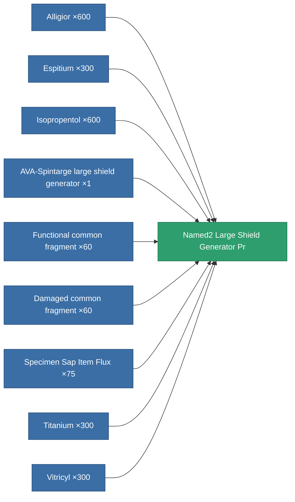

<!-- Generated by tools/generate from the live database (source: entitydefaults definition 5772, aggregatevalues via aggregatefields).
     Do not edit by hand; regenerate instead. -->

# Named2 Large Shield Generator Pr

|  |  |
|---|---|
| Definition | `def_named2_large_shield_generator_pr` |
| Tier | T3 (prototype) |
| Health | 100 |
| Volume | 1 |
| Mass | 880 |
| Category | Modules / Shield |
| Tier line | [Standard large shield generator](/content/items/standard-large-shield-generator/) (T1) → [AVA-Spintarge large shield generator](/content/items/named1-large-shield-generator/) (T2) → [Gegel Ioner large shield generator](/content/items/named2-large-shield-generator/) (T3) → **Named2 Large Shield Generator Pr** (T3) → [Umbeler large shield generator](/content/items/named3-large-shield-generator/) (T4) |
| Note | large module |

## Stats

| Field | Value |
|---|---|
| core_usage | 30 |
| cpu_usage | 335 |
| cycle_time | 7.75k |
| powergrid_usage | 1.35k |
| shield_absorbtion | 2 |
| shield_radius | 30 |

<!-- production:generated -->
## Production

**Produced from 9 components, research level 7** — assemble the components to build it (see [Recipes](/content/recipes/) for the full list):

[All items](/content/items/)
