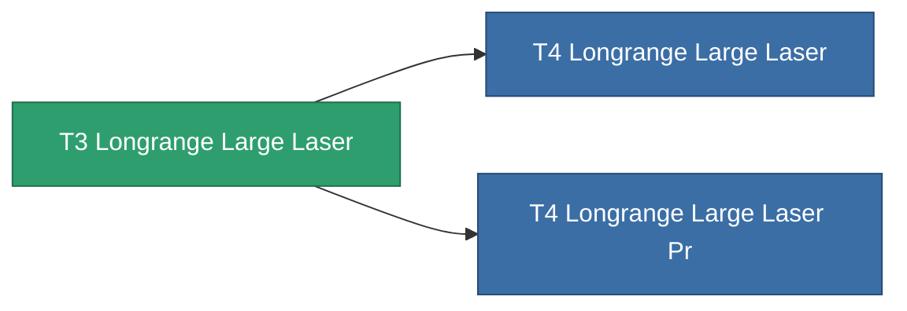

<!-- Generated by tools/generate from the live database (source: entitydefaults definition 1028, aggregatevalues via aggregatefields).
     Do not edit by hand; regenerate instead. -->

# T3 Longrange Large Laser

|  |  |
|---|---|
| Definition | `def_named2_longrange_large_laser` |
| Tier | T3 |
| Health | 100 |
| Volume | 1.5 |
| Mass | 1300 |
| Category | Modules / Weapons |
| Tier line | [T2 Longrange Large Laser](/content/items/named1-longrange-large-laser/) (T2) → **T3 Longrange Large Laser** (T3) → [T4 Longrange Large Laser](/content/items/named3-longrange-large-laser/) (T4) |

## Stats

| Field | Value |
|---|---|
| accuracy | 36 |
| core_usage | 14.7 |
| cpu_usage | 80 |
| cycle_time | 6k |
| damage_modifier | 1.88 |
| falloff | 25 |
| optimal_range | 45.5 |
| powergrid_usage | 411 |

<!-- production:generated -->
## Production

**Produced from 11 components** — assemble the components to build it (see [Recipes](/content/recipes/) for the full list):

<svg class="prod-card-icon" aria-hidden="true"><use href="#mi-grid"/></svg><a class="prod-card-name" href="/content/items/espitium/">Espitium</a>

required: <b>75</b>

<svg class="prod-card-icon" aria-hidden="true"><use href="#mi-grid"/></svg><a class="prod-card-name" href="/content/items/hydrobenol/">Hydrobenol</a>

required: <b>150</b>

<svg class="prod-card-icon" aria-hidden="true"><use href="#mi-robots"/></svg><a class="prod-card-name" href="/content/items/named1-longrange-large-laser/">T2 Longrange Large Laser</a>

required: <b>1</b>

<svg class="prod-card-icon" aria-hidden="true"><use href="#mi-grid"/></svg><a class="prod-card-name" href="/content/items/polynucleit/">Polynucleit</a>

required: <b>150</b>

<svg class="prod-card-icon" aria-hidden="true"><use href="#mi-grid"/></svg><a class="prod-card-name" href="/content/items/prilumium/">Prilumium</a>

required: <b>75</b>

<svg class="prod-card-icon" aria-hidden="true"><use href="#mi-crystal"/></svg><a class="prod-card-name" href="/content/items/robotshard-common-advanced/">Functional common fragment</a>

required: <b>30</b>

<svg class="prod-card-icon" aria-hidden="true"><use href="#mi-crystal"/></svg><a class="prod-card-name" href="/content/items/robotshard-common-basic/">Damaged common fragment</a>

required: <b>30</b>

<svg class="prod-card-icon" aria-hidden="true"><use href="#mi-crystal"/></svg><a class="prod-card-name" href="/content/items/robotshard-thelodica-advanced/">Functional thelodica fragment</a>

required: <b>30</b>

<svg class="prod-card-icon" aria-hidden="true"><use href="#mi-crystal"/></svg><a class="prod-card-name" href="/content/items/robotshard-thelodica-basic/">Damaged thelodica fragment</a>

required: <b>30</b>

<svg class="prod-card-icon" aria-hidden="true"><use href="#mi-grid"/></svg><a class="prod-card-name" href="/content/items/specimen-sap-item-flux/">Specimen Sap Item Flux</a>

required: <b>25</b>

<svg class="prod-card-icon" aria-hidden="true"><use href="#mi-grid"/></svg><a class="prod-card-name" href="/content/items/titanium/">Titanium</a>

required: <b>150</b>

## Used in production

**Component of 2 items** — everything that uses it in production:

