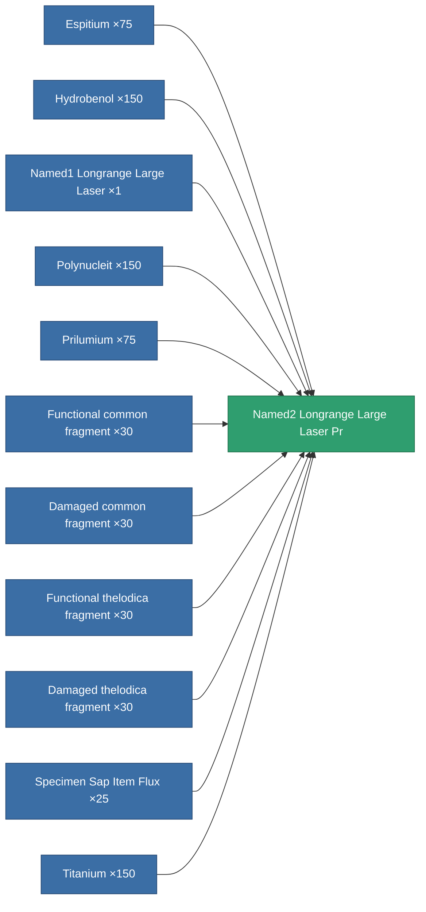

<!-- Generated by tools/generate from the live database (source: entitydefaults definition 5808, aggregatevalues via aggregatefields).
     Do not edit by hand; regenerate instead. -->

# Named2 Longrange Large Laser Pr

|  |  |
|---|---|
| Definition | `def_named2_longrange_large_laser_pr` |
| Tier | T3 (prototype) |
| Health | 100 |
| Volume | 1.5 |
| Mass | 1300 |
| Category | Modules / Weapons |
| Tier line | [Named1 Longrange Large Laser](/content/items/named1-longrange-large-laser/) (T2) → [Named2 Longrange Large Laser](/content/items/named2-longrange-large-laser/) (T3) → **Named2 Longrange Large Laser Pr** (T3) → [Named3 Longrange Large Laser](/content/items/named3-longrange-large-laser/) (T4) |
| Note | large weapon module |

## Stats

| Field | Value |
|---|---|
| accuracy | 36 |
| core_usage | 14.7 |
| cpu_usage | 80 |
| cycle_time | 6k |
| damage_modifier | 1.88 |
| falloff | 25 |
| optimal_range | 45.5 |
| powergrid_usage | 411 |

<!-- production:generated -->
## Production

**Produced from 11 components, research level 7** — assemble the components to build it (see [Recipes](/content/recipes/) for the full list):

[All items](/content/items/)
