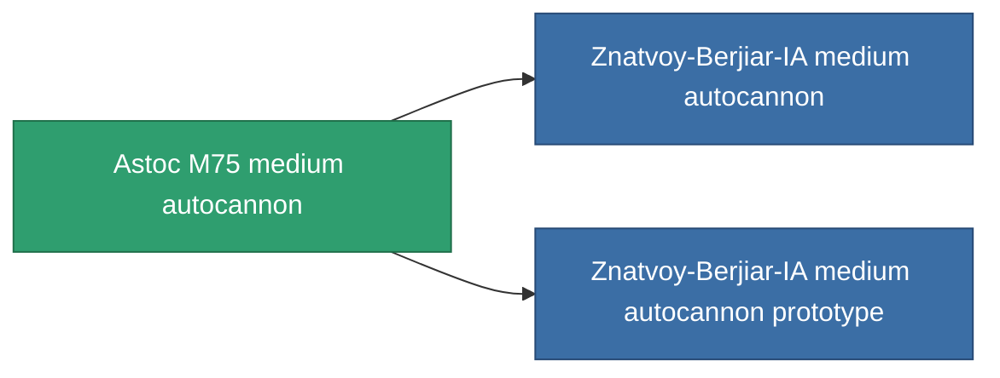

<!-- Generated by tools/generate from the live database (source: entitydefaults definition 1031, aggregatevalues via aggregatefields).
     Do not edit by hand; regenerate instead. -->

# Astoc M75 medium autocannon

|  |  |
|---|---|
| Definition | `def_named2_longrange_medium_autocannon` |
| Tier | T3 |
| Health | 100 |
| Volume | 1.2 |
| Mass | 650 |
| Category | Modules / Weapons |
| Tier line | [GTRB medium autocannon](/content/items/named1-longrange-medium-autocannon/) (T2) → **Astoc M75 medium autocannon** (T3) → [Znatvoy-Berjiar-IA medium autocannon](/content/items/named3-longrange-medium-autocannon/) (T4) |

## Stats

| Field | Value |
|---|---|
| accuracy | 18 |
| core_usage | 1.5 |
| cpu_usage | 13 |
| cycle_time | 6k |
| damage_modifier | 1.6 |
| falloff | 31 |
| least_optimal | 5 |
| optimal_range | 23.5 |
| powergrid_usage | 145 |

<!-- production:generated -->
## Production

**Produced from 6 components, research level 5** — assemble the components to build it (see [Recipes](/content/recipes/) for the full list):

<svg class="prod-card-icon" aria-hidden="true"><use href="#mi-grid"/></svg><a class="prod-card-name" href="/content/items/axicol/">Cryoperine</a>

required: <b>50</b>

<svg class="prod-card-icon" aria-hidden="true"><use href="#mi-grid"/></svg><a class="prod-card-name" href="/content/items/axicoline/">Axicoline</a>

required: <b>100</b>

<svg class="prod-card-icon" aria-hidden="true"><use href="#mi-grid"/></svg><a class="prod-card-name" href="/content/items/espitium/">Espitium</a>

required: <b>50</b>

<svg class="prod-card-icon" aria-hidden="true"><use href="#mi-grid"/></svg><a class="prod-card-name" href="/content/items/hydrobenol/">Hydrobenol</a>

required: <b>100</b>

<svg class="prod-card-icon" aria-hidden="true"><use href="#mi-robots"/></svg><a class="prod-card-name" href="/content/items/named1-longrange-medium-autocannon/">GTRB medium autocannon</a>

required: <b>1</b>

<svg class="prod-card-icon" aria-hidden="true"><use href="#mi-grid"/></svg><a class="prod-card-name" href="/content/items/titanium/">Titanium</a>

required: <b>100</b>

## Used in production

**Component of 2 items** — everything that uses it in production:

