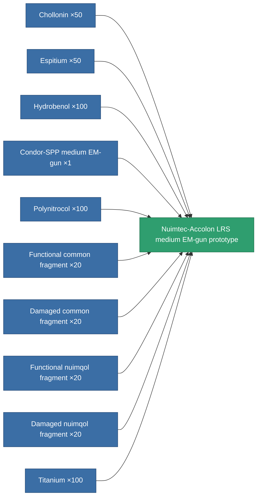

<!-- Generated by tools/generate from the live database (source: entitydefaults definition 2337, aggregatevalues via aggregatefields).
     Do not edit by hand; regenerate instead. -->

# Nuimtec-Accolon LRS medium EM-gun prototype

|  |  |
|---|---|
| Definition | `def_named2_longrange_medium_railgun_pr` |
| Tier | T3 (prototype) |
| Health | 100 |
| Volume | 1 |
| Mass | 650 |
| Category | Modules / Weapons |
| Tier line | [Condor-SPP medium EM-gun](/content/items/named1-longrange-medium-railgun/) (T2) → [Nuimtec-Accolon LRS medium EM-gun](/content/items/named2-longrange-medium-railgun/) (T3) → **Nuimtec-Accolon LRS medium EM-gun prototype** (T3) → [5.5-Glipler medium EM-gun](/content/items/named3-longrange-medium-railgun/) (T4) |

## Stats

| Field | Value |
|---|---|
| accuracy | 14 |
| core_usage | 25 |
| cpu_usage | 38 |
| cycle_time | 10k |
| damage_modifier | 2.5 |
| falloff | 6 |
| least_optimal | 22 |
| optimal_range | 30 |
| powergrid_usage | 176 |

<!-- production:generated -->
## Production

**Produced from 10 components, research level 6** — assemble the components to build it (see [Recipes](/content/recipes/) for the full list):

[All items](/content/items/)
