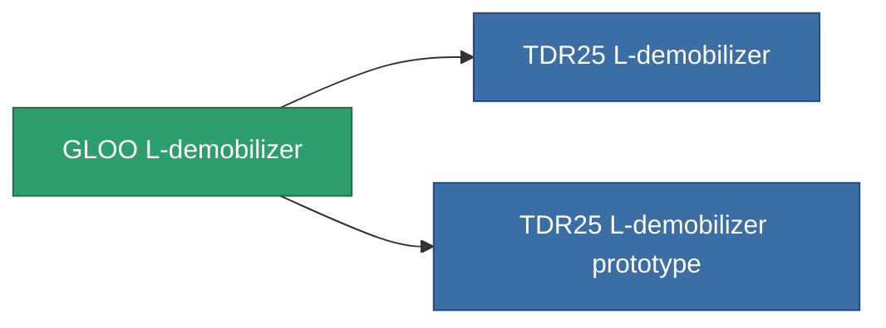

<!-- Generated by tools/generate from the live database (source: entitydefaults definition 3516, aggregatevalues via aggregatefields).
     Do not edit by hand; regenerate instead. -->

# GLOO L-demobilizer

|  |  |
|---|---|
| Definition | `def_named2_longrange_webber` |
| Tier | T3 |
| Health | 100 |
| Volume | 0.5 |
| Mass | 100 |
| Category | Modules / Enhancements |
| Tier line | [Standard L-demobilizer](/content/items/standard-longrange-webber/) (T1) → [Venom L-demobilizer](/content/items/named1-longrange-webber/) (T2) → **GLOO L-demobilizer** (T3) → [TDR25 L-demobilizer](/content/items/named3-longrange-webber/) (T4) |

## Stats

| Field | Value |
|---|---|
| core_usage | 37 |
| cpu_usage | 57 |
| cycle_time | 5k |
| effect_massivness_speed_max_modifier | 0.98 |
| falloff | 0 |
| optimal_range | 27.5 |
| powergrid_usage | 15 |

<!-- production:generated -->
## Production

**Produced from 8 components, research level 8** — assemble the components to build it (see [Recipes](/content/recipes/) for the full list):

<svg class="prod-card-icon" aria-hidden="true"><use href="#mi-grid"/></svg><a class="prod-card-name" href="/content/items/axicol/">Cryoperine</a>

required: <b>250</b>

<svg class="prod-card-icon" aria-hidden="true"><use href="#mi-grid"/></svg><a class="prod-card-name" href="/content/items/axicoline/">Axicoline</a>

required: <b>75</b>

<svg class="prod-card-icon" aria-hidden="true"><use href="#mi-grid"/></svg><a class="prod-card-name" href="/content/items/espitium/">Espitium</a>

required: <b>250</b>

<svg class="prod-card-icon" aria-hidden="true"><use href="#mi-grid"/></svg><a class="prod-card-name" href="/content/items/hydrobenol/">Hydrobenol</a>

required: <b>75</b>

<svg class="prod-card-icon" aria-hidden="true"><use href="#mi-grid"/></svg><a class="prod-card-name" href="/content/items/named1-longrange-webber/">Venom L-demobilizer</a>

required: <b>1</b>

<svg class="prod-card-icon" aria-hidden="true"><use href="#mi-crystal"/></svg><a class="prod-card-name" href="/content/items/robotshard-common-advanced/">Functional common fragment</a>

required: <b>20</b>

<svg class="prod-card-icon" aria-hidden="true"><use href="#mi-crystal"/></svg><a class="prod-card-name" href="/content/items/robotshard-common-basic/">Damaged common fragment</a>

required: <b>20</b>

<svg class="prod-card-icon" aria-hidden="true"><use href="#mi-grid"/></svg><a class="prod-card-name" href="/content/items/titanium/">Titanium</a>

required: <b>100</b>

## Used in production

**Component of 2 items** — everything that uses it in production:

