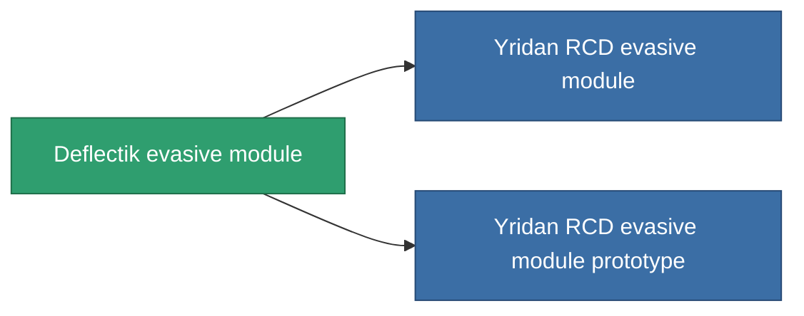

<!-- Generated by tools/generate from the live database (source: entitydefaults definition 2566, aggregatevalues via aggregatefields).
     Do not edit by hand; regenerate instead. -->

# Deflectik evasive module

|  |  |
|---|---|
| Definition | `def_named2_maneuvering_upgrade` |
| Tier | T3 |
| Health | 100 |
| Volume | 0.5 |
| Mass | 30 |
| Category | Modules / Enhancements |
| Tier line | [Standard evasive module](/content/items/standard-maneuvering-upgrade/) (T1) → [R4S-S evasive module](/content/items/named1-maneuvering-upgrade/) (T2) → **Deflectik evasive module** (T3) → [Yridan RCD evasive module](/content/items/named3-maneuvering-upgrade/) (T4) |

## Stats

| Field | Value |
|---|---|
| cpu_usage | 25 |
| massiveness | 0.06 |
| powergrid_usage | 25 |
| signature_radius | -1 |

<!-- production:generated -->
## Production

**Produced from 8 components, research level 7** — assemble the components to build it (see [Recipes](/content/recipes/) for the full list):

<svg class="prod-card-icon" aria-hidden="true"><use href="#mi-grid"/></svg><a class="prod-card-name" href="/content/items/alligior/">Alligior</a>

required: <b>75</b>

<svg class="prod-card-icon" aria-hidden="true"><use href="#mi-grid"/></svg><a class="prod-card-name" href="/content/items/axicol/">Cryoperine</a>

required: <b>75</b>

<svg class="prod-card-icon" aria-hidden="true"><use href="#mi-grid"/></svg><a class="prod-card-name" href="/content/items/espitium/">Espitium</a>

required: <b>75</b>

<svg class="prod-card-icon" aria-hidden="true"><use href="#mi-panel"/></svg><a class="prod-card-name" href="/content/items/named1-maneuvering-upgrade/">R4S-S evasive module</a>

required: <b>1</b>

<svg class="prod-card-icon" aria-hidden="true"><use href="#mi-grid"/></svg><a class="prod-card-name" href="/content/items/plasteosine/">Plasteosine</a>

required: <b>75</b>

<svg class="prod-card-icon" aria-hidden="true"><use href="#mi-crystal"/></svg><a class="prod-card-name" href="/content/items/robotshard-common-advanced/">Functional common fragment</a>

required: <b>30</b>

<svg class="prod-card-icon" aria-hidden="true"><use href="#mi-crystal"/></svg><a class="prod-card-name" href="/content/items/robotshard-common-basic/">Damaged common fragment</a>

required: <b>30</b>

<svg class="prod-card-icon" aria-hidden="true"><use href="#mi-grid"/></svg><a class="prod-card-name" href="/content/items/titanium/">Titanium</a>

required: <b>100</b>

## Used in production

**Component of 2 items** — everything that uses it in production:

