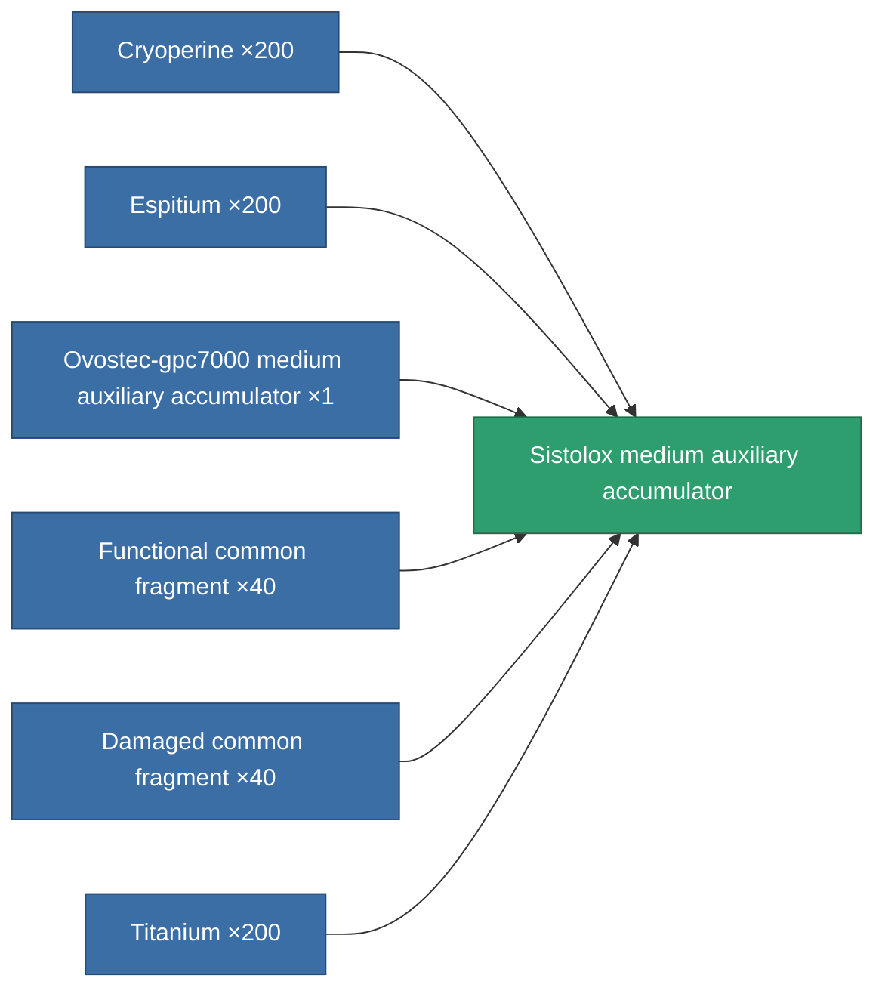
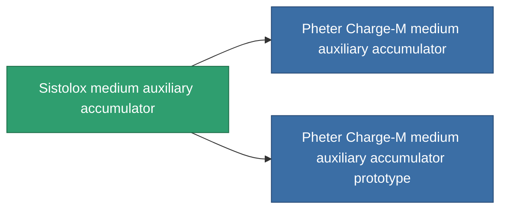

<!-- Generated by tools/generate from the live database (source: entitydefaults definition 817, aggregatevalues via aggregatefields).
     Do not edit by hand; regenerate instead. -->

# Sistolox medium auxiliary accumulator

|  |  |
|---|---|
| Definition | `def_named2_medium_core_battery` |
| Tier | T3 |
| Health | 100 |
| Volume | 1 |
| Mass | 1500 |
| Category | Modules / Power |
| Tier line | [Standard medium auxiliary accumulator](/content/items/standard-medium-core-battery/) (T1) → [Ovostec-gpc7000 medium auxiliary accumulator](/content/items/named1-medium-core-battery/) (T2) → **Sistolox medium auxiliary accumulator** (T3) → [Pheter Charge-M medium auxiliary accumulator](/content/items/named3-medium-core-battery/) (T4) |

## Stats

| Field | Value |
|---|---|
| core_max | 400 |
| cpu_usage | 43 |
| powergrid_usage | 107 |

<!-- production:generated -->
## Production

**Produced from 6 components, research level 6** — assemble the components to build it (see [Recipes](/content/recipes/) for the full list):

## Used in production

**Component of 2 items** — everything that uses it in production:

[All items](/content/items/)
