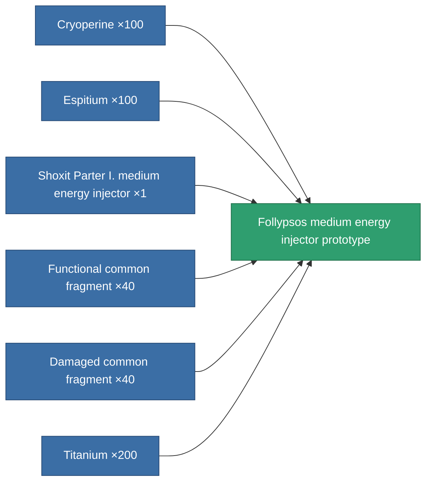

<!-- Generated by tools/generate from the live database (source: entitydefaults definition 2292, aggregatevalues via aggregatefields).
     Do not edit by hand; regenerate instead. -->

# Follypsos medium energy injector prototype

|  |  |
|---|---|
| Definition | `def_named2_medium_core_booster_pr` |
| Tier | T3 (prototype) |
| Health | 100 |
| Volume | 1 |
| Mass | 150 |
| Category | Modules / Enhancements |
| Tier line | [Standard medium energy injector](/content/items/standard-medium-core-booster/) (T1) → [Shoxit Parter I. medium energy injector](/content/items/named1-medium-core-booster/) (T2) → [Follypsos medium energy injector](/content/items/named2-medium-core-booster/) (T3) → **Follypsos medium energy injector prototype** (T3) → [Cerepter II. medium energy injector](/content/items/named3-medium-core-booster/) (T4) |

## Stats

| Field | Value |
|---|---|
| core_usage | 0 |
| cpu_usage | 24 |
| cycle_time | 10k |
| powergrid_usage | 261 |

<!-- production:generated -->
## Production

**Produced from 6 components, research level 6** — assemble the components to build it (see [Recipes](/content/recipes/) for the full list):

[All items](/content/items/)
