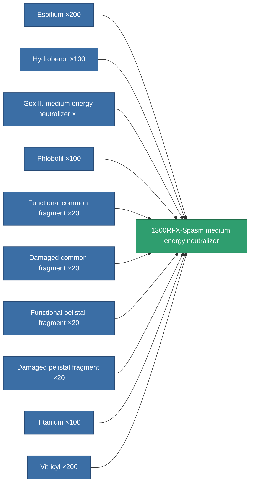
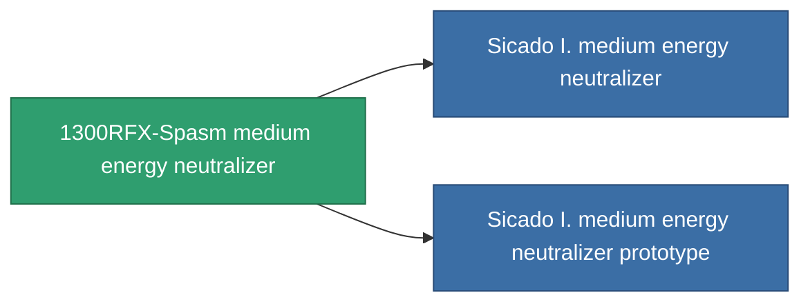

<!-- Generated by tools/generate from the live database (source: entitydefaults definition 757, aggregatevalues via aggregatefields).
     Do not edit by hand; regenerate instead. -->

# 1300RFX-Spasm medium energy neutralizer

|  |  |
|---|---|
| Definition | `def_named2_medium_energy_neutralizer` |
| Tier | T3 |
| Health | 100 |
| Volume | 1 |
| Mass | 500 |
| Category | Modules / Shield |
| Tier line | [Standard medium energy neutralizer](/content/items/standard-medium-energy-neutralizer/) (T1) → [Gox II. medium energy neutralizer](/content/items/named1-medium-energy-neutralizer/) (T2) → **1300RFX-Spasm medium energy neutralizer** (T3) → [Sicado I. medium energy neutralizer](/content/items/named3-medium-energy-neutralizer/) (T4) |

## Stats

| Field | Value |
|---|---|
| core_usage | 225 |
| cpu_usage | 37 |
| cycle_time | 10k |
| energy_dispersion | 10 |
| energy_neutralized_amount | 270 |
| falloff | 0 |
| optimal_range | 25 |
| powergrid_usage | 210 |

<!-- production:generated -->
## Production

**Produced from 10 components, research level 6** — assemble the components to build it (see [Recipes](/content/recipes/) for the full list):

## Used in production

**Component of 2 items** — everything that uses it in production:

[All items](/content/items/)
