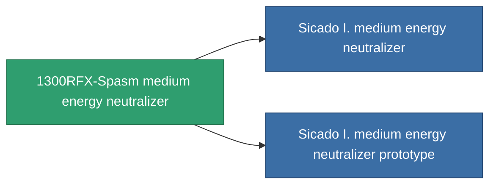

<!-- Generated by tools/generate from the live database (source: entitydefaults definition 757, aggregatevalues via aggregatefields).
     Do not edit by hand; regenerate instead. -->

# 1300RFX-Spasm medium energy neutralizer

|  |  |
|---|---|
| Definition | `def_named2_medium_energy_neutralizer` |
| Tier | 3 |
| Health | 100 |
| Volume | 1 |
| Mass | 500 |
| Category | Modules / Shield |

## Stats

| Field | Value |
|---|---|
| core_usage | 225 |
| cpu_usage | 37 |
| cycle_time | 10k |
| energy_dispersion | 10 |
| energy_neutralized_amount | 270 |
| falloff | 0 |
| optimal_range | 25 |
| powergrid_usage | 210 |

<!-- production:generated -->
## Production

**Component of 2 items** — everything that uses it in production:

[All items](/content/items/)
