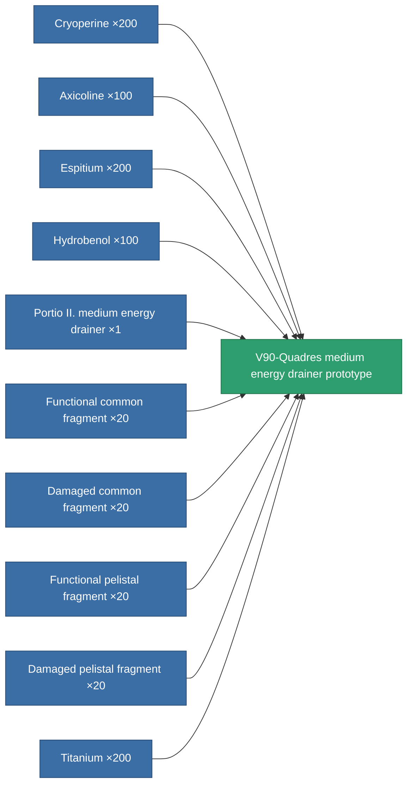

<!-- Generated by tools/generate from the live database (source: entitydefaults definition 2223, aggregatevalues via aggregatefields).
     Do not edit by hand; regenerate instead. -->

# V90-Quadres medium energy drainer prototype

|  |  |
|---|---|
| Definition | `def_named2_medium_energy_vampire_pr` |
| Tier | T3 (prototype) |
| Health | 100 |
| Volume | 1 |
| Mass | 375 |
| Category | Modules / Shield |
| Tier line | [Standard medium energy drainer](/content/items/standard-medium-energy-vampire/) (T1) → [Portio II. medium energy drainer](/content/items/named1-medium-energy-vampire/) (T2) → [V90-Quadres medium energy drainer](/content/items/named2-medium-energy-vampire/) (T3) → **V90-Quadres medium energy drainer prototype** (T3) → [Filch-AM medium energy drainer](/content/items/named3-medium-energy-vampire/) (T4) |

## Stats

| Field | Value |
|---|---|
| core_usage | 13 |
| cpu_usage | 54 |
| cycle_time | 10k |
| energy_dispersion | 10 |
| energy_vampired_amount | 100 |
| falloff | 0 |
| optimal_range | 27.5 |
| powergrid_usage | 176 |

<!-- production:generated -->
## Production

**Produced from 10 components, research level 6** — assemble the components to build it (see [Recipes](/content/recipes/) for the full list):

[All items](/content/items/)
