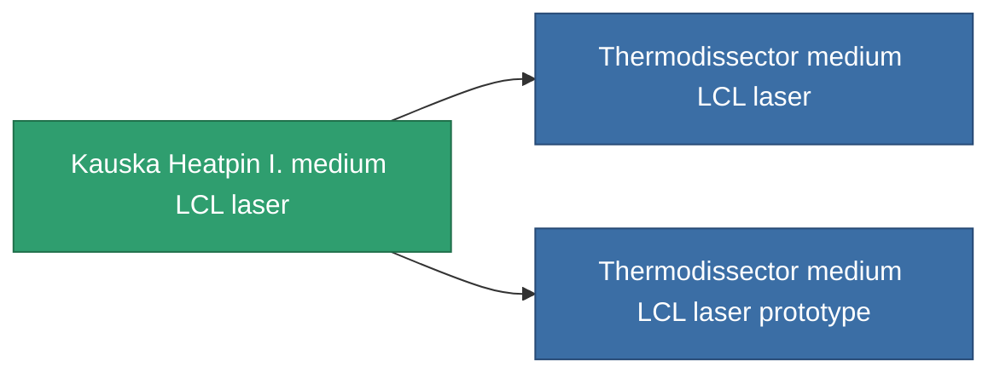

<!-- Generated by tools/generate from the live database (source: entitydefaults definition 835, aggregatevalues via aggregatefields).
     Do not edit by hand; regenerate instead. -->

# Kauska Heatpin I. medium LCL laser

|  |  |
|---|---|
| Definition | `def_named2_medium_laser` |
| Tier | 3 |
| Health | 100 |
| Volume | 1 |
| Mass | 500 |
| Category | Modules / Weapons |

## Stats

| Field | Value |
|---|---|
| accuracy | 11.5 |
| core_usage | 16 |
| cpu_usage | 28 |
| cycle_time | 4.5k |
| damage_modifier | 1.38 |
| falloff | 10 |
| least_optimal | 4.5 |
| optimal_range | 18.5 |
| powergrid_usage | 225 |

<!-- production:generated -->
## Production

**Component of 2 items** — everything that uses it in production:

[All items](/content/items/)
