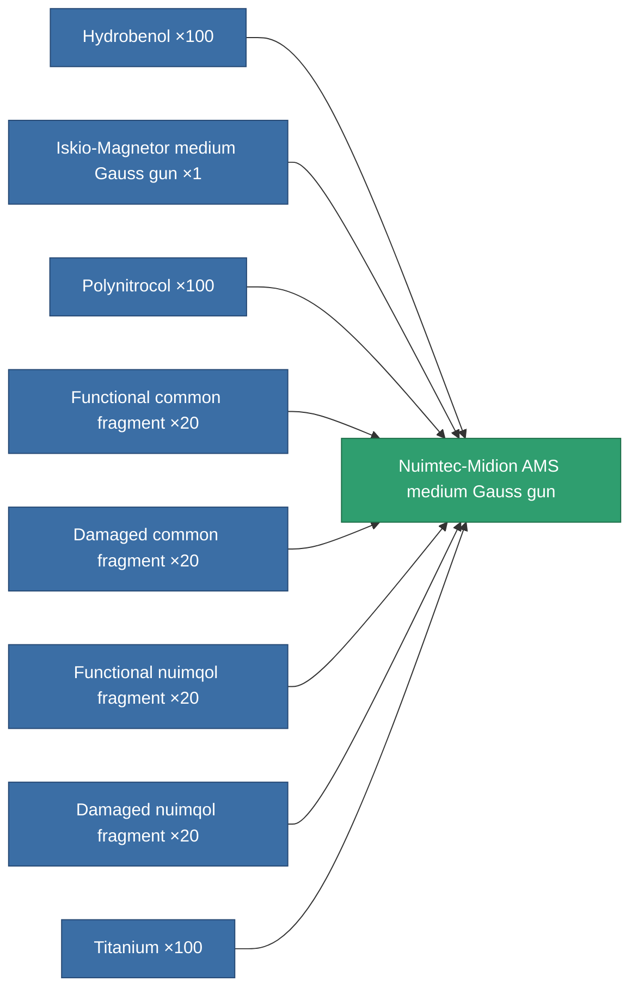
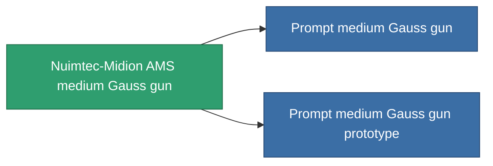

<!-- Generated by tools/generate from the live database (source: entitydefaults definition 862, aggregatevalues via aggregatefields).
     Do not edit by hand; regenerate instead. -->

# Nuimtec-Midion AMS medium Gauss gun

|  |  |
|---|---|
| Definition | `def_named2_medium_railgun` |
| Tier | T3 |
| Health | 100 |
| Volume | 1 |
| Mass | 500 |
| Category | Modules / Weapons |
| Tier line | [Standard medium Gauss gun](/content/items/standard-medium-railgun/) (T1) → [Iskio-Magnetor medium Gauss gun](/content/items/named1-medium-railgun/) (T2) → **Nuimtec-Midion AMS medium Gauss gun** (T3) → [Prompt medium Gauss gun](/content/items/named3-medium-railgun/) (T4) |

## Stats

| Field | Value |
|---|---|
| accuracy | 13.5 |
| core_usage | 15 |
| cpu_usage | 35 |
| cycle_time | 6k |
| damage_modifier | 2 |
| falloff | 6 |
| least_optimal | 13 |
| optimal_range | 16.5 |
| powergrid_usage | 165 |

<!-- production:generated -->
## Production

**Produced from 8 components, research level 6** — assemble the components to build it (see [Recipes](/content/recipes/) for the full list):

## Used in production

**Component of 2 items** — everything that uses it in production:

[All items](/content/items/)
