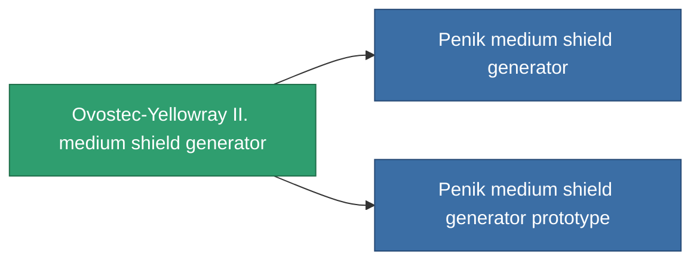

<!-- Generated by tools/generate from the live database (source: entitydefaults definition 727, aggregatevalues via aggregatefields).
     Do not edit by hand; regenerate instead. -->

# Ovostec-Yellowray II. medium shield generator

|  |  |
|---|---|
| Definition | `def_named2_medium_shield_generator` |
| Tier | 3 |
| Health | 100 |
| Volume | 0.5 |
| Mass | 440 |
| Category | Modules / Shield |

## Stats

| Field | Value |
|---|---|
| core_usage | 12.5 |
| cpu_usage | 67 |
| cycle_time | 7.75k |
| powergrid_usage | 270 |
| shield_absorbtion | 2.2 |
| shield_radius | 12 |

<!-- production:generated -->
## Production

**Component of 2 items** — everything that uses it in production:

[All items](/content/items/)
