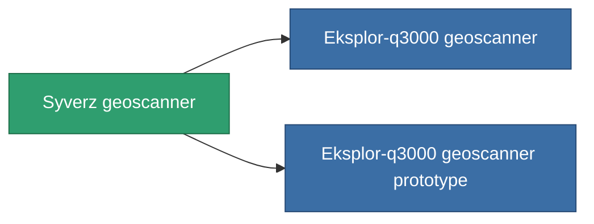

<!-- Generated by tools/generate from the live database (source: entitydefaults definition 781, aggregatevalues via aggregatefields).
     Do not edit by hand; regenerate instead. -->

# Syverz geoscanner

|  |  |
|---|---|
| Definition | `def_named2_mining_probe_module` |
| Tier | T3 |
| Health | 100 |
| Volume | 1 |
| Mass | 200 |
| Category | Modules / Enhancements |
| Tier line | [Standard geoscanner](/content/items/standard-mining-probe-module/) (T1) → [Ovostec-Chisomel geoscanner](/content/items/named1-mining-probe-module/) (T2) → **Syverz geoscanner** (T3) → [Eksplor-q3000 geoscanner](/content/items/named3-mining-probe-module/) (T4) |

## Stats

| Field | Value |
|---|---|
| core_usage | 70 |
| cpu_usage | 50 |
| cycle_time | 12.5k |
| mining_probe_accuracy | 0.6 |
| powergrid_usage | 50 |

<!-- production:generated -->
## Production

**Produced from 6 components, research level 3** — assemble the components to build it (see [Recipes](/content/recipes/) for the full list):

<svg class="prod-card-icon" aria-hidden="true"><use href="#mi-grid"/></svg><a class="prod-card-name" href="/content/items/axicol/">Cryoperine</a>

required: <b>175</b>

<svg class="prod-card-icon" aria-hidden="true"><use href="#mi-grid"/></svg><a class="prod-card-name" href="/content/items/espitium/">Espitium</a>

required: <b>175</b>

<svg class="prod-card-icon" aria-hidden="true"><use href="#mi-grid"/></svg><a class="prod-card-name" href="/content/items/named1-mining-probe-module/">Ovostec-Chisomel geoscanner</a>

required: <b>1</b>

<svg class="prod-card-icon" aria-hidden="true"><use href="#mi-crystal"/></svg><a class="prod-card-name" href="/content/items/robotshard-common-advanced/">Functional common fragment</a>

required: <b>20</b>

<svg class="prod-card-icon" aria-hidden="true"><use href="#mi-crystal"/></svg><a class="prod-card-name" href="/content/items/robotshard-common-basic/">Damaged common fragment</a>

required: <b>20</b>

<svg class="prod-card-icon" aria-hidden="true"><use href="#mi-grid"/></svg><a class="prod-card-name" href="/content/items/titanium/">Titanium</a>

required: <b>50</b>

## Used in production

**Component of 2 items** — everything that uses it in production:

