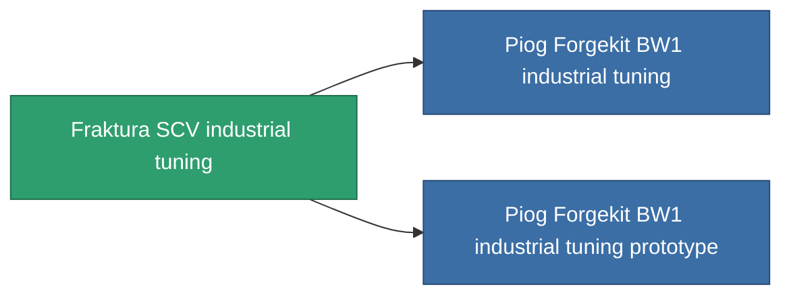

<!-- Generated by tools/generate from the live database (source: entitydefaults definition 805, aggregatevalues via aggregatefields).
     Do not edit by hand; regenerate instead. -->

# Fraktura SCV industrial tuning

|  |  |
|---|---|
| Definition | `def_named2_mining_upgrade` |
| Tier | 3 |
| Health | 100 |
| Volume | 0.1 |
| Mass | 60 |
| Category | Modules / Enhancements |

## Stats

| Field | Value |
|---|---|
| cpu_usage | 37 |
| harvesting_amount_modifier | 1.075 |
| mining_amount_modifier | 1.075 |
| powergrid_usage | 21 |

<!-- production:generated -->
## Production

**Component of 2 items** — everything that uses it in production:

[All items](/content/items/)
