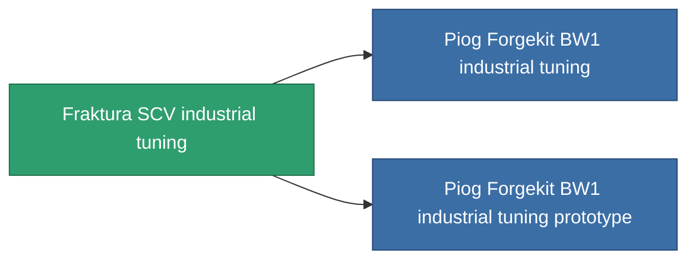

<!-- Generated by tools/generate from the live database (source: entitydefaults definition 805, aggregatevalues via aggregatefields).
     Do not edit by hand; regenerate instead. -->

# Fraktura SCV industrial tuning

|  |  |
|---|---|
| Definition | `def_named2_mining_upgrade` |
| Tier | T3 |
| Health | 100 |
| Volume | 0.1 |
| Mass | 60 |
| Category | Modules / Enhancements |
| Tier line | [Standard industrial tuning](/content/items/standard-mining-upgrade/) (T1) → [Piog Forgekit AI industrial tuning](/content/items/named1-mining-upgrade/) (T2) → **Fraktura SCV industrial tuning** (T3) → [Piog Forgekit BW1 industrial tuning](/content/items/named3-mining-upgrade/) (T4) |

## Stats

| Field | Value |
|---|---|
| cpu_usage | 37 |
| harvesting_amount_modifier | 1.075 |
| mining_amount_modifier | 1.075 |
| powergrid_usage | 21 |

<!-- production:generated -->
## Production

**Produced from 6 components, research level 5** — assemble the components to build it (see [Recipes](/content/recipes/) for the full list):

<svg class="prod-card-icon" aria-hidden="true"><use href="#mi-grid"/></svg><a class="prod-card-name" href="/content/items/axicol/">Cryoperine</a>

required: <b>100</b>

<svg class="prod-card-icon" aria-hidden="true"><use href="#mi-grid"/></svg><a class="prod-card-name" href="/content/items/espitium/">Espitium</a>

required: <b>100</b>

<svg class="prod-card-icon" aria-hidden="true"><use href="#mi-panel"/></svg><a class="prod-card-name" href="/content/items/named1-mining-upgrade/">Piog Forgekit AI industrial tuning</a>

required: <b>1</b>

<svg class="prod-card-icon" aria-hidden="true"><use href="#mi-crystal"/></svg><a class="prod-card-name" href="/content/items/robotshard-common-advanced/">Functional common fragment</a>

required: <b>20</b>

<svg class="prod-card-icon" aria-hidden="true"><use href="#mi-crystal"/></svg><a class="prod-card-name" href="/content/items/robotshard-common-basic/">Damaged common fragment</a>

required: <b>20</b>

<svg class="prod-card-icon" aria-hidden="true"><use href="#mi-grid"/></svg><a class="prod-card-name" href="/content/items/titanium/">Titanium</a>

required: <b>50</b>

## Used in production

**Component of 2 items** — everything that uses it in production:

