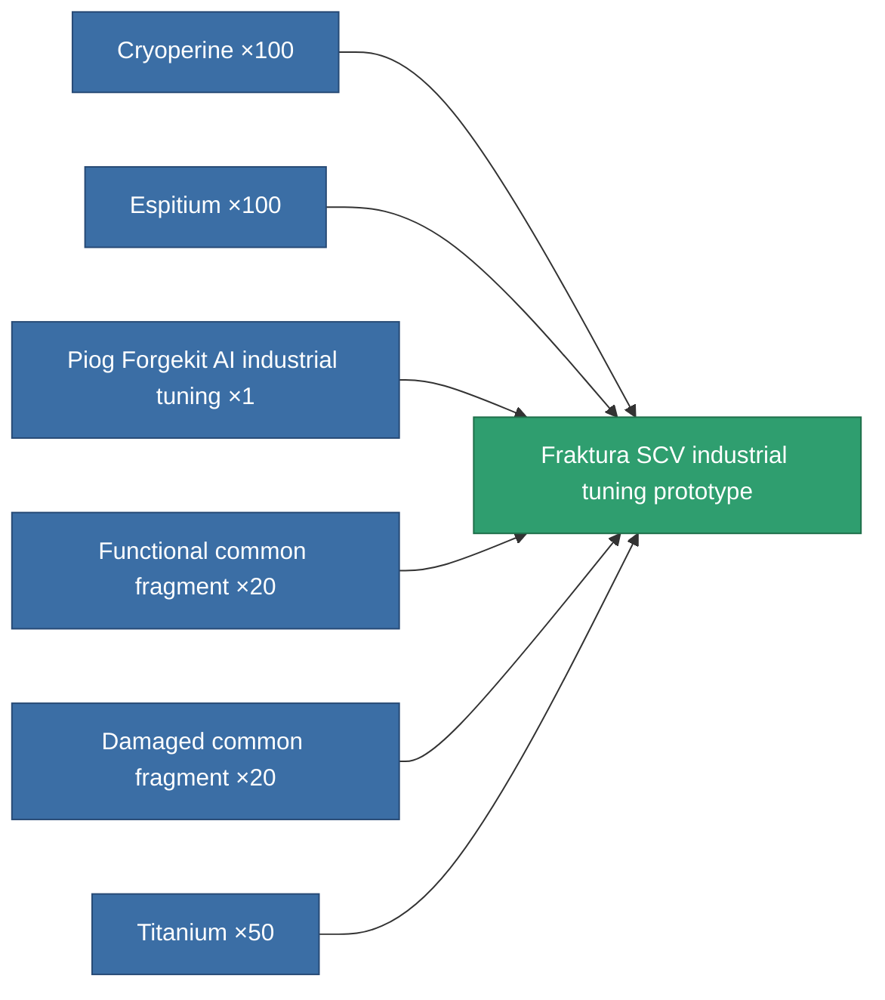

<!-- Generated by tools/generate from the live database (source: entitydefaults definition 2274, aggregatevalues via aggregatefields).
     Do not edit by hand; regenerate instead. -->

# Fraktura SCV industrial tuning prototype

|  |  |
|---|---|
| Definition | `def_named2_mining_upgrade_pr` |
| Tier | 3 |
| Health | 100 |
| Volume | 0.1 |
| Mass | 45 |
| Category | Modules / Enhancements |

## Stats

| Field | Value |
|---|---|
| cpu_usage | 31 |
| harvesting_amount_modifier | 1.075 |
| mining_amount_modifier | 1.075 |
| powergrid_usage | 20 |

<!-- production:generated -->
## Production

**Produced from 6 components, research level 5** — assemble the components to build it (see [Recipes](/content/recipes/) for the full list):

[All items](/content/items/)
