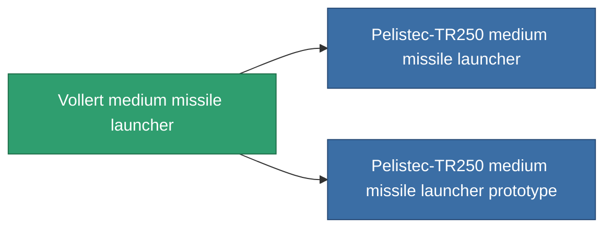

<!-- Generated by tools/generate from the live database (source: entitydefaults definition 853, aggregatevalues via aggregatefields).
     Do not edit by hand; regenerate instead. -->

# Vollert medium missile launcher

|  |  |
|---|---|
| Definition | `def_named2_missile_launcher` |
| Tier | 3 |
| Health | 100 |
| Volume | 2 |
| Mass | 500 |
| Category | Modules / Weapons |

## Stats

| Field | Value |
|---|---|
| accuracy | 1 |
| core_usage | 2 |
| cpu_usage | 42 |
| cycle_time | 12k |
| damage_modifier | 1 |
| module_missile_range_modifier | 1.1 |
| powergrid_usage | 160 |

<!-- production:generated -->
## Production

**Component of 2 items** — everything that uses it in production:

[All items](/content/items/)
